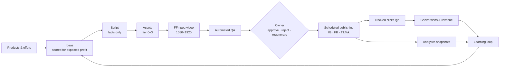

# Content Revenue Engine

Automated multi-brand **content → distribution → analytics → revenue** engine for Instagram, Facebook and TikTok.
It turns products (affiliate offers, lead-gen services, own products) into short vertical videos, publishes them
through official APIs, measures clicks and revenue with its own tracking, and feeds what earned money back into
what gets made next.

The owner's recurring job is to **approve, reject or regenerate** — from a phone. Everything else is automated,
budget-guarded and logged.



## Highlights

- **Profit first.** Ideas are ranked by estimated profit (expected impressions × CTR × conversion × payout − cost);
  dashboards show revenue − AI cost − infrastructure − ads per brand, content, product, platform and day.
- **Cheap by default.** Tier 0 videos (real product cut-outs, cheap generated backgrounds, programmatic motion,
  kinetic typography) cost about **$0.02** in API fees; AI video shots are used only when performance data
  justifies them. Target: ≤ $0.50 per accepted video. See [docs/COST_MODEL.md](docs/COST_MODEL.md).
- **Budget guard on every paid call.** Estimate → reserve → execute → commit. Brand daily/weekly/monthly limits,
  global limits, per-content and AI-video caps; exceeding any of them parks the work as `BUDGET_BLOCKED` instead
  of spending.
- **Multi-brand from day one**, each with its own voice, visual identity, products, disclosure rules, budgets,
  publishing slots and learning profile.
- **Compliance built in.** Claims only from stored, sourced product facts; affiliate/ad/AI disclosures enforced by
  QA; no fake reviews or testimonials; privacy-minimised click tracking.
- **Mock mode** runs the whole lifecycle locally with zero spend — real FFmpeg renders, simulated publishing,
  analytics, clicks and conversions (clearly flagged as simulated).
- **Provider-agnostic.** DeepSeek is the default LLM (any OpenAI-compatible API works); fal.ai for images,
  background removal and image-to-video; OpenAI/ElevenLabs/local TTS; local disk or S3/R2 storage; Meta and TikTok
  publishers — all behind interfaces with mocks.

## Safety defaults

Out of the box **nothing costs money and nothing is posted**:

| Setting                                | Default     | Meaning                                                                     |
| -------------------------------------- | ----------- | --------------------------------------------------------------------------- |
| `MOCK_AI`, `MOCK_MEDIA`, `MOCK_SOCIAL` | `true`      | Local mock providers, no external calls                                     |
| `PUBLISHING_ENABLED`                   | `false`     | Kill switch: real publications are refused even when accounts are connected |
| `HARD_DAILY_BUDGET_USD`                | `5`         | System-wide cap on real API spend per UTC day                               |
| `TIKTOK_PRIVACY_LEVEL`                 | `SELF_ONLY` | TikTok posts are private                                                    |

## Quick start

Requirements: Node.js ≥ 22.12, pnpm 10, FFmpeg (libx264, libass), Docker (or local PostgreSQL 16 + Redis 7).

```bash
corepack enable
pnpm install                 # also generates the Prisma client
cp .env.example .env         # safe defaults
docker compose up -d         # PostgreSQL + Redis
pnpm db:migrate              # apply migrations
pnpm db:seed                 # owner account + Demo Beauty / Demo Tools / Demo SaaS with products
pnpm demo                    # full mock lifecycle: idea → video → QA → approve → publish → analytics → profit
pnpm dev                     # dashboard: http://localhost:3000 (login from SEED_OWNER_EMAIL / _PASSWORD)
pnpm worker                  # background worker (second terminal)
```

`pnpm demo` prints the produced videos (copied to `.data/demo/`), the simulated cost, QA score, schedule, the
profit view and the learning-loop summary. Options: `--brand <slug|all> --count <n> --fast --no-approve --days <n>`.

## Commands

| Command                                              | Purpose                                                                                                  |
| ---------------------------------------------------- | -------------------------------------------------------------------------------------------------------- |
| `pnpm dev` / `pnpm build` / `pnpm start`             | Next.js dashboard (development / production build / production server)                                   |
| `pnpm worker`                                        | Worker: outbox dispatcher, BullMQ processors, maintenance tick (`WORKER_QUEUES=render` to run one queue) |
| `pnpm demo`                                          | End-to-end mock demo (no Redis needed)                                                                   |
| `pnpm test`                                          | Unit tests                                                                                               |
| `pnpm test:integration`                              | Integration tests (PostgreSQL + FFmpeg)                                                                  |
| `pnpm typecheck` / `pnpm lint` / `pnpm format:check` | Static checks                                                                                            |
| `pnpm db:migrate` / `pnpm db:seed`                   | Apply migrations / seed demo data (idempotent)                                                           |
| `pnpm services:up` / `pnpm services:down`            | Start / stop the Docker Compose services                                                                 |

## Dashboard

| Page                        | What it is for                                                                                                                      |
| --------------------------- | ----------------------------------------------------------------------------------------------------------------------------------- |
| `/dashboard`                | KPIs: awaiting approval, published today, scheduled, failed jobs, cost today/month, clicks, conversions, revenue, profit, ROI       |
| `/approval`                 | Mobile-first queue: video, captions per platform, QA report, cost → approve / reject (with reason) / regenerate (scope) / edit text |
| `/content`, `/content/[id]` | Every item with status, tier and router reasons, assets with provenance, variants, publications, job timeline, experiments          |
| `/brands`, `/brands/[id]`   | Brand identity, voice, rules, disclosures, budgets, slots, social accounts (OAuth connect)                                          |
| `/products`                 | Products, sourced facts, offers, affiliate links; CSV import                                                                        |
| `/calendar`                 | Scheduled and published posts per day                                                                                               |
| `/analytics`                | Funnel and profitability by brand / content / product / platform / day                                                              |
| `/revenue`                  | Manual conversions, CSV import, postback setup, expenses                                                                            |
| `/costs`                    | Spend vs. budgets, cost per content / approved / published / conversion                                                             |
| `/jobs`                     | Failed, dead-lettered and budget-blocked jobs with timelines; retry                                                                 |
| `/settings/providers`       | Active providers and models, health checks, safety switches                                                                         |

Public routes: `/go/<code>` (tracking redirect), `/b/<slug>` (brand link-in-bio page),
`/api/webhooks/conversions/<programId>` (affiliate postbacks), `/api/health`.

## Repository

```
apps/web          Next.js dashboard, approval UI, tracking redirect, bio pages, webhooks, OAuth
apps/worker       worker process and the mock demo
packages/shared   money (micro-USD), errors, logging, crypto, similarity, time
packages/config   env schema, provider selection, pricing catalog, tiers, defaults
packages/db       Prisma schema, migrations, seed
packages/ai       LLM providers (DeepSeek, OpenAI-compatible, mock), versioned prompts, structured output
packages/providers image / video / background removal / TTS / music / storage providers
packages/media    VideoProject schema and FFmpeg compositor
packages/publishing social publishers (mock, Meta, TikTok), OAuth, platform limits
packages/analytics metrics, evidence levels, performance profiles
packages/core     state machines, budgets, router, scoring, QA, approval, scheduling, tracking, revenue, reports
packages/pipeline job handlers, runner, dispatchers, experiments
docs/             architecture and operating documentation
```

## Documentation

- [Architecture](docs/ARCHITECTURE.md) — components, data model, state machines, jobs
- [Pipeline](docs/PIPELINE.md) — every step from idea to analytics, QA, approval, experiments
- [Providers](docs/PROVIDERS.md) — LLM, media, TTS, storage and social adapters; mock mode
- [Cost model](docs/COST_MODEL.md) — prices, tier costs, budgets, profit metrics
- [Deployment](docs/DEPLOYMENT.md) — production setup, scaling, going from mock to real
- [Social APIs](docs/SOCIAL_APIS.md) — Meta and TikTok setup, permissions, review/audit requirements
- [Security](docs/SECURITY.md) — auth, encryption, privacy, compliance
- [Implementation plan](docs/IMPLEMENTATION_PLAN.md) — phases, decisions, risks

## Status

The MVP is implemented and runs end to end in mock mode. Verified here: unit and integration tests (PostgreSQL +
FFmpeg), the mock demo for all demo brands, the BullMQ worker, the production web build and the dashboard
flows. The real provider and platform adapters are tested against scripted HTTP responses only — **no live API
has been called** (no keys were used). Before going live, follow the step-by-step switch from mock to real in
[docs/DEPLOYMENT.md](docs/DEPLOYMENT.md#going-from-mock-to-real--one-switch-at-a-time).
