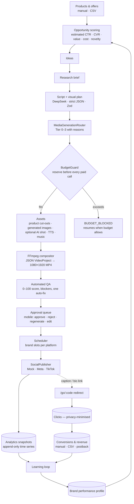
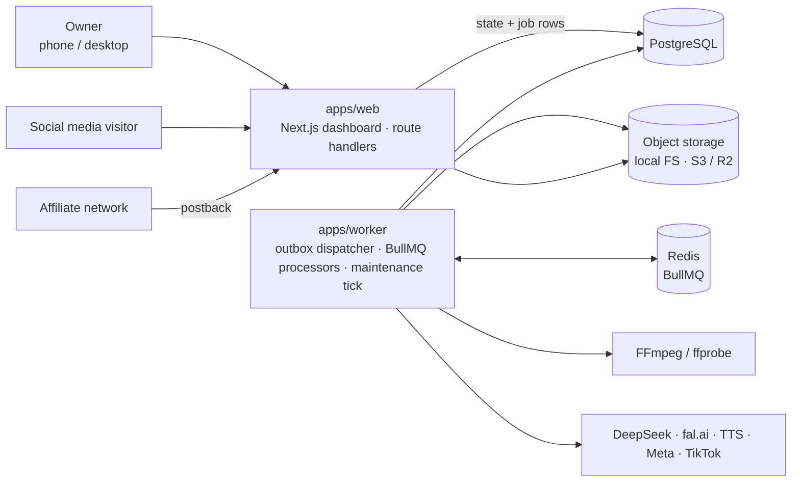
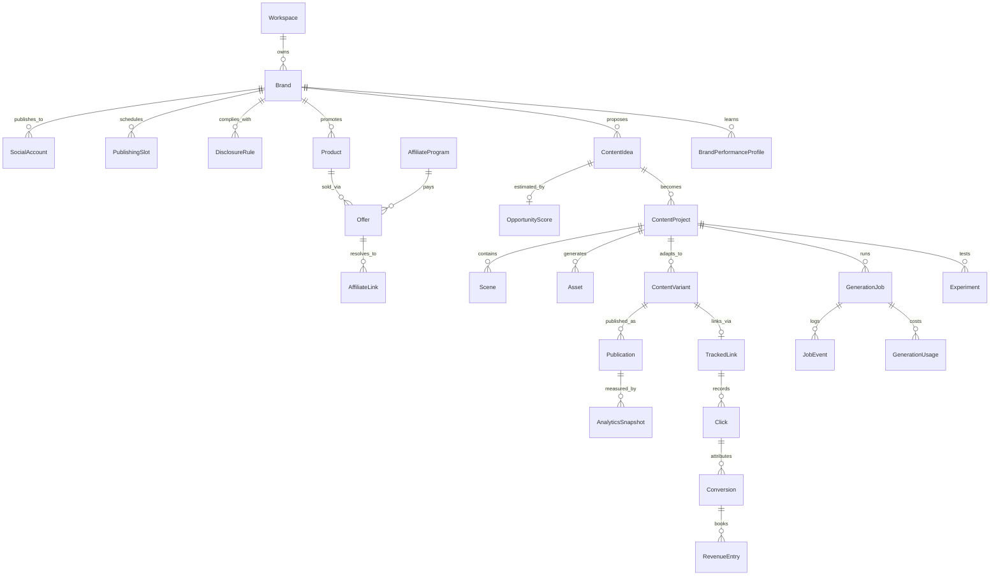
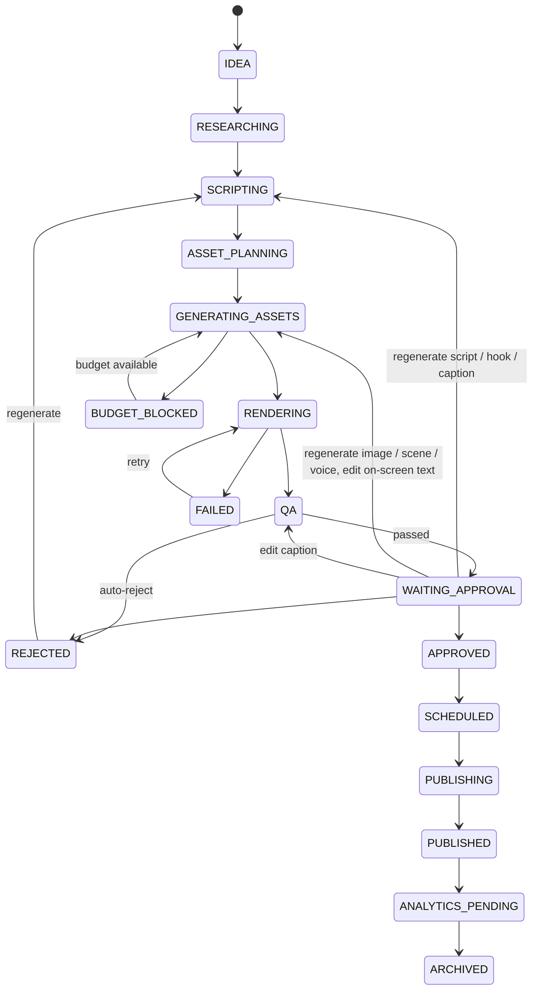
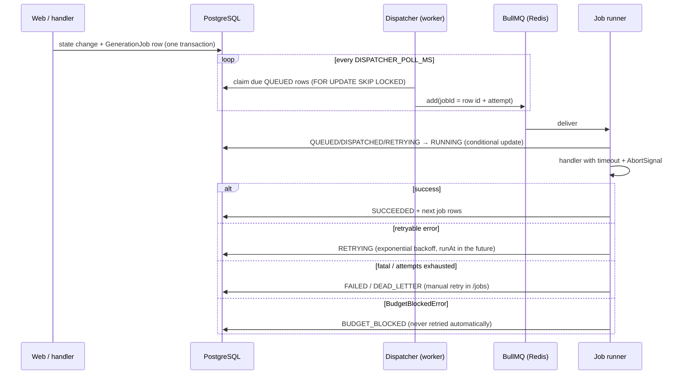
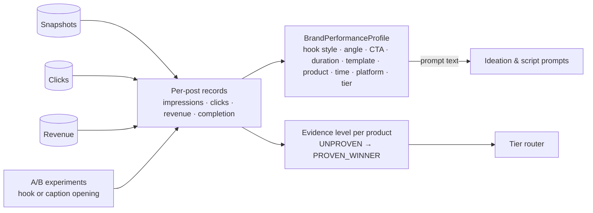

# Architecture

Content Revenue Engine turns product data into short vertical videos, publishes them, measures what happens
and feeds the results back into what gets made next. Everything is optimised for one chain:

**CONTENT → ATTENTION → CLICK → CONVERSION → REVENUE**, at the lowest generation cost that still works.

The owner's recurring job is to **approve, reject or regenerate**. Everything else is automated, budget-guarded
and logged.

## System overview

## Runtime topology

- **Two processes, one database.** The web app never does heavy work; it writes state and job rows. The worker
  executes jobs. The web app does not need Redis.
- **PostgreSQL is the source of truth**, including for jobs. Redis only transports work; losing Redis loses no
  work (see [Jobs](#jobs-and-queues)).
- **Media lives in object storage**; rows keep storage keys and provenance only.

## Monorepo

| Path                  | Responsibility                                                                                                                                                                                                                  |
| --------------------- | ------------------------------------------------------------------------------------------------------------------------------------------------------------------------------------------------------------------------------- |
| `apps/web`            | Next.js 16 dashboard (all pages), mobile approval UI, `/go/:code` tracking redirect, `/b/:slug` bio pages, postback webhooks, OAuth start/callback, authenticated media streaming, health endpoint.                             |
| `apps/worker`         | Worker process (`pnpm worker`) and the end-to-end mock demo (`pnpm demo`).                                                                                                                                                      |
| `packages/shared`     | Money in micro-USD, error taxonomy (retryable / fatal / budget-blocked), logger, hashing & AES-GCM, text similarity, time helpers.                                                                                              |
| `packages/config`     | The only place that reads `process.env` (Zod-validated), provider selection, model catalog, pricing catalog, tier plans, job defaults.                                                                                          |
| `packages/db`         | Prisma 7 schema and migrations, client factory, seed data (Demo Beauty / Demo Tools / Demo SaaS).                                                                                                                               |
| `packages/ai`         | `LLMProvider` (DeepSeek default, any OpenAI-compatible API, mock), versioned prompts, structured output with a Zod repair loop.                                                                                                 |
| `packages/providers`  | Image, image-to-video, background removal, TTS, music and storage providers — real adapters and free local mocks.                                                                                                               |
| `packages/media`      | `VideoProject` schema, FFmpeg timeline compositor, libass kinetic typography, scene renderers, ffprobe/QA probes.                                                                                                               |
| `packages/publishing` | `SocialPublisher` (mock, Meta, TikTok), OAuth helpers, platform limits.                                                                                                                                                         |
| `packages/analytics`  | Pure metric math (CTR, RPM, ROI, profit), latest-snapshot aggregation, performance evidence levels, performance profiles.                                                                                                       |
| `packages/core`       | Domain services shared by web and worker: state machines, cost ledger & BudgetGuard, router, opportunity scoring, text QA, approval & regeneration, scheduling, tracking links, revenue import, job outbox, KPI/profit reports. |
| `packages/pipeline`   | Step executors (one per job type), job runner, inline and BullMQ dispatchers, A/B experiments, learning loop.                                                                                                                   |

Dependency direction has no cycles: `shared ← config ← db ← analytics ← core ← pipeline ← worker`;
`ai`, `providers`, `media` and `publishing` depend only on `shared`/`config` (+ `media` for probing). The web app
depends on `core` (plus `publishing` for OAuth and `providers` for storage). Packages are consumed as TypeScript
source — there is no build step in development.

## Data model

Full definitions: `packages/db/prisma/schema.prisma`. Money is `Decimal(18,6)` USD in the database and integer
micro-USD in code. Rows created by mocks carry `isMock` / `isSimulated` so simulated numbers can never be
mistaken for real money.

Key separations the model enforces:

- **Idea ≠ master creative ≠ platform variant ≠ publication.** One `ContentProject` (master video) fans out to one
  `ContentVariant` per platform (caption, hashtags, disclosure, tracked link) and each variant to `Publication`s.
- **Estimates ≠ actuals.** `OpportunityScore` holds estimates; `AnalyticsSnapshot`, `Click`, `Conversion` and
  `RevenueEntry` hold measurements. `GenerationUsage` keeps `estimatedCostUsd` and `actualCostUsd` side by side.
- **Snapshots are never overwritten.** Platforms report cumulative metrics, so reports use the latest snapshot per
  publication; the history stays for time-series charts.
- **Provenance per asset**: source, provider, model, prompt, inputs (`AssetInput`), cost, licence, timestamps.

## State machines

All status changes go through table-driven state machines (`packages/core/src/lifecycle/state-machine.ts`) and
are applied with optimistic concurrency (`UPDATE … WHERE status = $from`); a lost race raises
`StateConflictError` instead of silently overwriting. Each transition is audited.

Simplified: every working state can move to `FAILED` (and paid states to `BUDGET_BLOCKED`); both remember where to
resume. Variants, publications and jobs have their own machines:

- `ContentVariant`: `PENDING → READY → APPROVED | REJECTED | SKIPPED → SCHEDULED → PUBLISHING → PUBLISHED | FAILED`
- `Publication`: `SCHEDULED → PUBLISHING → PUBLISHED | FAILED`, `FAILED → SCHEDULED` (retry), `CANCELLED`
- `GenerationJob`: `QUEUED → DISPATCHED → RUNNING → SUCCEEDED | RETRYING | FAILED | DEAD_LETTER | BUDGET_BLOCKED`

## Jobs and queues

- **Transactional outbox.** A job row is written in the same transaction as the state change that needs it, keyed
  by an `idempotencyKey` (`ON CONFLICT DO NOTHING`). Redis loss or a crash never loses or duplicates work.
- **Idempotent handlers.** Re-delivering a job is a no-op: assets are content-addressed (a READY asset with the same
  input hash is reused, never re-bought), async provider requests persist their request id before polling so a
  restarted worker resumes instead of paying twice, and cost rows are keyed per operation.
- **Fan-out / fan-in.** One job per asset; rendering starts when all assets are READY, guarded by a row lock on
  the project.
- **Queues** (`QUEUE_NAMES`): `strategy`, `research`, `scripts`, `images`, `video_generation`, `tts`, `render`,
  `qa`, `publish`, `analytics`, `maintenance`; final failures are mirrored to `dead_letter`. Heavy queues can run in
  separate worker processes: `WORKER_QUEUES=render pnpm worker`.
- **Observability.** Every job writes `START / SUCCESS / FAILURE / RETRY / COST` events (pino JSON logs with
  `runId`, `brandId`, `contentId`, `jobId`) and mirrors them into `JobEvent` for the dashboard timeline (`/jobs`,
  `/content/[id]`).
- **Inline dispatcher.** The same handlers run in-process with a simulated clock — used by tests and `pnpm demo`,
  no Redis needed.

## Providers

Business code depends on interfaces only; `packages/config` decides which implementation and model is used.
Every provider exposes `healthCheck`, `estimateCost` and `execute`. Details: [PROVIDERS.md](PROVIDERS.md).

## Money and safety rails

1. **Estimate → reserve → execute → commit/release** for every paid call (`CostLedger` + `BudgetGuard`). If any
   budget would be exceeded the call does not happen; the job becomes `BUDGET_BLOCKED` with machine-readable
   reasons. See [COST_MODEL.md](COST_MODEL.md).
2. **Tiered generation.** Unproven ideas get Tier 0 (cents); premium spend requires measured performance.
3. **Mock mode by default.** `MOCK_AI`, `MOCK_MEDIA`, `MOCK_SOCIAL` default to `true` and still produce real
   files, so the compositor, QA, dashboard and analytics run end to end for free.
4. **Publishing kill switch.** `PUBLISHING_ENABLED=false` (default) refuses every real publication, even with
   connected accounts and an approved item.
5. **Human approval** before anything is scheduled.

## Learning loop

No machine learning: the profile compares each dimension value against the brand baseline (RPM once there is
revenue, CTR before) with a minimum sample size, and the strongest/weakest patterns are injected into prompts.
Experiments vary one cheap variable on shared assets and are decided conservatively (see
[PIPELINE.md](PIPELINE.md#ab-experiments)).

## Security

Server-side sessions and authorization on every page, action and route; encrypted third-party credentials;
privacy-minimised click tracking; signed OAuth state; authenticated postbacks. See [SECURITY.md](SECURITY.md).
