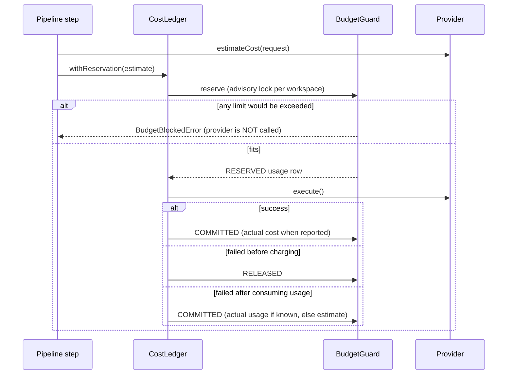

# Cost model

Target: **≤ $0.50 per accepted short video**, and never spend premium money on an idea that has not shown it
can earn it back.

> All prices below come from the pricing catalog (`packages/config/src/pricing.ts`), each entry with an "as of"
> date. They are **estimates** — providers change prices. Verify against current price pages and your invoices
> before relying on them, and update the catalog. When a provider reports the real cost it is stored as
> `actualCostUsd` and takes precedence.

## Unit prices in the catalog

| Provider / model                                      | Unit                                         | Catalog price           |
| ----------------------------------------------------- | -------------------------------------------- | ----------------------- |
| DeepSeek `deepseek-chat`                              | 1M input tokens (cache miss / cache hit)     | $0.28 / $0.028          |
|                                                       | 1M output tokens                             | $0.42                   |
| OpenAI `gpt-4o-mini` (optional)                       | 1M input (miss / hit) · 1M output            | $0.15 / $0.075 · $0.60  |
| fal `flux/schnell` · `flux/dev` · `flux-pro/v1.1`     | per megapixel (rounded up)                   | $0.003 · $0.025 · $0.04 |
| fal `birefnet` (background removal)                   | per image                                    | $0.002                  |
| fal Kling v2.1 image-to-video standard · pro · master | per second (5 s minimum)                     | $0.05 · $0.09 · $0.28   |
| OpenAI `tts-1`                                        | 1M characters                                | $15                     |
| ElevenLabs `eleven_flash_v2_5`                        | 1M characters (plan-dependent, conservative) | $100                    |
| flite (local), procedural music, FFmpeg               | —                                            | $0                      |

Models missing from the catalog fall back to a **deliberately pessimistic** price so an unknown model can never
look cheap.

## Cost per item by tier

Estimated with the router's own cost function (`estimateTierCost`) for a typical item: one 3k-in / 1.5k-out
script call, two generated 768×1344 backgrounds, one real product cut-out, ~380 characters of voice-over when
enabled:

| Tier   | Image class | AI video                | Without voice-over | With voice-over (OpenAI) | When                                      |
| ------ | ----------- | ----------------------- | ------------------ | ------------------------ | ----------------------------------------- |
| Tier 0 | cheap       | none                    | **≈ $0.016**       | ≈ $0.021                 | Default for every new / unproven idea     |
| Tier 1 | cheap       | 1 × 5 s, standard model | ≈ $0.27            | ≈ $0.27                  | Product/idea shows promising CTR          |
| Tier 2 | standard    | 1 × 5 s, pro model      | ≈ $0.55            | ≈ $0.56                  | High performer, value justifies it        |
| Tier 3 | premium     | up to 3 × 5 s, master   | ≈ $1.56            | ≈ $1.57                  | Proven winner only (conversions + profit) |

Breakdown at Tier 0 (no voice): LLM $0.0015 · images $0.012 · background removal $0.002. At Tier 1 the AI shot
($0.25) is ~94% of the cost — which is why it is never used before an idea has evidence.

The full LLM chain per item (share of ideation, research, script, captions, optional QA review) adds roughly
$0.003–0.01 with DeepSeek; repeated system prompts benefit from cache-hit pricing.

**Observed in mock mode** (`MOCK_COST_MODE=simulate` records what the real providers would have charged):
Tier 0 videos $0.01–0.02 each; a Tier 1 video with one AI shot $0.28 (`pnpm demo`, October 2026).

## Cost per accepted video

```
cost per accepted video = all generation spend in the period ÷ approved items
```

Rejected items, regenerations and QA auto-fixes are included, so the metric tells the truth about waste. Example
at Tier 0 with a 50% acceptance rate: 2 × $0.02 = **≈ $0.04 per accepted video**. Mixing in Tier 1 for one item in
five keeps it around $0.10–0.15. Tier 2 alone exceeds the target, which is why it requires measured performance
and an expected value that pays for it.

## How spending is controlled



Checked on **every** paid call, in one transaction holding a per-workspace advisory lock (so parallel workers
cannot overspend together). Spend = committed + outstanding reservations.

| Limit                         | Scope                         | Seed default  | Effect when exceeded                      |
| ----------------------------- | ----------------------------- | ------------- | ----------------------------------------- |
| Daily / weekly / monthly      | brand                         | $1 / $5 / $15 | Job + project → `BUDGET_BLOCKED`          |
| Daily / monthly (global)      | workspace                     | $3 / $40      | Same                                      |
| Max cost per content          | each content item             | $0.50         | Router downgrades tier; otherwise blocked |
| Max AI-video cost per content | each content item             | $0.30         | AI shots dropped / blocked                |
| Max regenerations             | each content item             | 3             | Further regenerations refused             |
| `HARD_DAILY_BUDGET_USD`       | whole system, real money only | $5 (env)      | Fail-safe on top of all DB budgets        |

Budgets are edited per brand on `/brands/[id]`; current spend vs. limits is on `/costs`.

Additional rules:

- **Router economics.** Above Tier 0 the estimated generation cost must stay below 35% of the idea's estimated
  revenue; otherwise the tier is lowered. Every downgrade is recorded with its reason.
- **Reuse before regenerate.** Assets are content-addressed and scoped regeneration only redoes what changed;
  hook/caption changes keep every asset and re-render from the scene cache (no new media spend).
- **Resume, don't re-buy.** Async jobs persist the provider request id before polling.
- **Crashed workers.** Reservations older than 2 hours are settled by the maintenance tick: real ones are
  committed at the estimate (the provider may have charged — verify against the invoice), mock ones released.
- **A/B tests reuse assets.** Hook and caption tests cost a re-render or nothing.

## Profit, ROI and the other metrics

| Metric                                               | Formula                                                                   |
| ---------------------------------------------------- | ------------------------------------------------------------------------- |
| CTR                                                  | tracked clicks ÷ impressions                                              |
| Conversion rate                                      | conversions ÷ clicks                                                      |
| RPM                                                  | revenue ÷ impressions × 1000                                              |
| Revenue per click                                    | revenue ÷ clicks                                                          |
| Cost per content / approved / published / conversion | generation cost ÷ count                                                   |
| Profit                                               | revenue − AI generation cost − infrastructure − ad spend − other expenses |
| ROI                                                  | (revenue − cost) ÷ cost                                                   |

Infrastructure, ads, tools and other costs are entered as `Expense` rows (one-off or spread over `periodDays`) and
prorated into the period being viewed. AI cost of a master video is shared by its platform variants (split evenly
per publication in the per-platform view). Clicks and revenue are attributed to brand, content, product and
platform through the tracked link and click id.

Simulated (mock) numbers are flagged and kept out of real-money views unless explicitly included.

## Levers if costs drift

1. Keep voice-over off for brands where on-screen text works (`ttsEnabled`), or use `flite` while testing.
2. Generated image size: FLUX is billed per (rounded-up) megapixel; the 768×1344 backgrounds round up to 2 MP —
   720×1280 would fit in 1 MP at slightly lower sharpness.
3. Lower the brand tier ceiling (`maxTier`) or disable AI video (`allowAiVideo`).
4. Tighten `maxContentCostUsd` / `maxAiVideoCostUsd`; the router adapts automatically.
5. Generate fewer ideas per cycle and rely on the opportunity score to pick the best.
