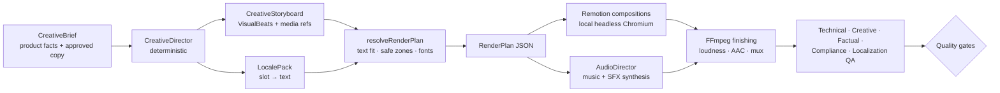

# Creative Engine V2

Local-first, deterministic production of short vertical product reels (1080×1920, 30 fps, 15–30 s). V2 replaces
the V1 "template slideshow" (FFmpeg timeline + ASS subtitles) with a renderer-independent scene model, a
deterministic creative director, measured typography and a real motion renderer. V1 stays in place for existing
projects; V2 is switched on per project from Phase G.



Nothing in this chain calls a model or a paid service. The only cost is local CPU time.

## Packages

| Package                                | What it contains                                                                                                                                                                  |
| -------------------------------------- | --------------------------------------------------------------------------------------------------------------------------------------------------------------------------------- |
| `@cre/creative` (browser-safe)         | Scene model (`model.ts`), creative brief, 15 structures, 6 category style kits, director, layout grid, text fitting, subtitles, safe zones, render-plan resolver, QA rules        |
| `@cre/creative/node`                   | Font files (fontsource woff2) and the fontkit measurer, stable hashing, `prepareCreative()`                                                                                       |
| `@cre/creative/benchmark`              | The six DEMO_ONLY benchmark briefs and the demo media catalogue (geometry + anchors)                                                                                              |
| `@cre/motion` — `src/remotion/*`       | Remotion compositions: beats, transitions, typography, overlays (callouts, counters, lists, steps, sliders, particles …), kit backgrounds, global layers, parametric demo artwork |
| `@cre/motion` — `render.ts`            | Bundles the compositions once (cached by source hash), renders with a local Chromium (`renderReelVideo`, `renderReelStills`, `renderMediaSheets`)                                 |
| `@cre/motion` — `audio/*`, `finish.ts` | Deterministic music/SFX synthesis, look-ahead limiter, two-pass EBU R128 loudness normalisation, mux, poster                                                                      |
| `@cre/motion` — `qa/*`                 | Technical QA on the delivered file: FFmpeg probes plus local frame statistics (luma, frame difference, dHash)                                                                     |

## Scene model

A **CreativeStoryboard** is plain JSON and does not depend on any renderer:

- `beats[]` — **VisualBeats** (16 types such as `HOOK_VISUAL`, `PRODUCT_HERO`, `PRODUCT_MACRO`, `FEATURE_CALLOUT`,
  `NUMBER_STAT`, `PRODUCT_IN_USE`, `BEFORE_AFTER`, `SIDE_BY_SIDE`, `SCREEN_DEMO`, `PROCESS_STEP`, `CTA_CARD`), each
  with a purpose, layout, duration, media layers (box, crop, zoom, motion preset, keyframed parameters), text
  elements that reference **slots**, overlays and an incoming transition.
- `media[]` — **MediaRefs** with provenance, licence, `placeholder` / `demoOnly` flags and named **anchors**
  (normalised points used as callout targets and macro focus points).
- `textSlots` — per-slot localization constraints (max words/chars/lines, minimum font size, visible time, locked
  tokens such as numbers and units).
- `style` — the style kit tokens (palette, fonts per role, size ranges, radius, background, motion energy, overlay
  style, alignment).
- `audio` — music mood/BPM and timed SFX cues; `flags` — `placeholderMedia`, `demoOnly`.

The text itself lives in a **LocalePack** (`slot → string`, `*emphasis*` markup). Localizing a reel means
supplying another pack: every visual decision is reused, only text is re-measured.

## Creative director

`directCreative(brief)` walks the recipe of the brief's structure (15 structures, e.g. `SPEC_BREAKDOWN`,
`PRODUCT_DEMO`, `PROBLEM_SOLUTION`, `TEST_RESULT`, `THREE_THINGS_TO_KNOW`, `BEFORE_AFTER`), builds each beat from
the brief's material and skips steps without material (then tops up to the 6-beat minimum). It then:

1. sets durations from the beat's base length, the kit's pacing, **reading time as a hard floor**, the 15–30 s
   target and the music grid (half-beat at the kit's BPM, so cuts land on the beat);
2. picks transitions from the kit's rotation (cut into the hook; entrance motions are softened under moving
   transitions so no frame is ever empty);
3. places SFX cues on transitions and overlay events, thinned deterministically to the kit's density;
4. derives text-slot constraints for localization and the placeholder / demo flags.

Same brief → byte-identical storyboard (tested), which makes renders cacheable and reproducible.

### Niche shot grammars

A different palette is not a different visual identity. The **shot grammar** decides which shots tell a
structure for a category (`SHOT_GRAMMARS` in `structures.ts`). Beauty × `PRODUCT_HERO`, for example:

| #   | Shot                                                                        | Builder         |
| --- | --------------------------------------------------------------------------- | --------------- |
| 1   | lit hero on stone, product from frame 0, five-word hook                     | `HOOK` (scene)  |
| 2   | packaging macro with animated pictogram chips (SPF 50, mineral filter)      | `MACRO` + chips |
| 3   | the product in its ritual (morning vanity, window light, foreground leaves) | `LIFESTYLE`     |
| 4   | how it works — diagram with pictogram labels instead of a bullet list       | `INGREDIENT`    |
| 5   | texture / application macro (dollop swiped into a sheer film)               | `IN_USE`        |
| 6–8 | three benefits as rapid cuts, each with its own image and one label         | `MONTAGE`       |
| 9   | hero return in a new setting (hard summer shadows)                          | `HERO_RETURN`   |
| 10  | CTA card over the scene, product visible below it                           | `CTA` (scene)   |

Kits without a grammar for a structure use the structure's generic recipe; grammars for the remaining categories
follow after the Tools + Beauty quality bar is approved.

### Camera layer

Every beat has a camera move (zoom / drift, linear over the beat). It is applied to the _world_ — media, beat
background and anchored overlays (callouts, rings, particles, light sweeps) — while text, cards, chips, counters
and lists stay fixed, so motion never costs legibility. Callout, comparison and screen beats keep a still camera.

## Style kits (category visual languages)

| Kit        | Look                                                                 | Type                           | Motion / sound                              |
| ---------- | -------------------------------------------------------------------- | ------------------------------ | ------------------------------------------- |
| tools      | dark workshop, pegboard, amber accent, industrial marker highlights  | Barlow Condensed 800 + Inter   | whip transitions, flash cuts, drive 124 BPM |
| gadgets    | deep navy tech grid, cyan glow                                       | Space Grotesk                  | slides, masks, scale-ins, tech 118 BPM      |
| home       | warm cream, light shafts, amber + sage                               | Manrope                        | soft fades and blurs, chill 96 BPM          |
| automotive | asphalt with motion streaks, racing red, skewed condensed type       | Saira Condensed 800 (−8° skew) | whips and flashes, drive 132 BPM            |
| beauty     | soft studio blush, bokeh, terracotta accents, centred editorial type | Playfair Display italic + Jost | long blurs and fades, elegant 84 BPM        |
| pet        | warm home, wooden floor, orange + teal, rounded labels               | Nunito 900                     | springy pops, warm 104 BPM                  |

## Typography and text fitting

- Fonts are OFL `@fontsource` woff2 files. The **same files** are measured with fontkit (shaping, kerning,
  ligatures — within 0.002 % of Chromium) and loaded by the renderer under private aliases (`cre-<Family>`), so
  system fonts can never shadow them.
- `fitText()` finds the largest size that fits the box in at most `maxLines`, balancing lines (no orphans) for
  display, headline, body and CTA roles. It **never shrinks below the role's minimum readable size** — copy that
  does not fit is reported (`TEXT_OVERFLOW`, `WORD_TOO_LONG`) and fails QA instead of becoming tiny.
- Emphasis markers never split words (`*tones*:` stays one word); separators (`·`, `—`) never start a line.
- The renderer receives explicit lines and never wraps text on its own.

## Safe zones and layout grid

Text lives inside the area that is safe on TikTok, Instagram Reels and Facebook Reels at the same time: below
184 px, above 1364 px (the band down to 1436 px is reserved for the disclosure line), ≥ 72 px from the left edge
and left of the action rail (x ≤ 924) from y = 700 down. Drawn text bounds are checked against every platform's
unsafe areas (`checkSafeZones`). Text set over imagery always gets a scrim (`onMedia` white on a dark scrim);
the disclosure and timers sit on chips.

## Motion renderer (Remotion)

- Compositions: `CreativeReel` (props = `RenderPlan`) and `MediaSheet` (artwork review with anchors).
- Beats overlap during transitions (whip, slide, scale, blur, fade, mask wipe, flash); the total duration never
  changes.
- Media motion presets: cinematic push, slow zoom, pans, crop / masked reveals, parallax, product float, drop-in,
  slide-in, whip-in, macro drift, tilt-in. Vector media is redrawn at the target size every frame, so 3× macro
  shots stay sharp.
- Overlays: pictogram chips (benefits as visual labels, never bullet slides), callouts with anchored leader lines, rings and brackets, gauge / bar / plain counters (Intl number
  formatting per locale, idle "breathing" once settled), spec lists, checklists, numbered steps synced to media
  parameters, before/after slider, badges and CTA buttons, panels, particles (dust, crumbs, fur, sparkle, light),
  light sweeps, cursor with click ripples, countdown timer.
- Global layers: segmented progress bar, disclosure, vignette, film grain, burned-in **DEMO MEDIA · NOT
  PRODUCTION** label whenever placeholder or demo media is used.
- `render.ts` bundles once per source hash (≈ 5 s, cached), copies the measured font files into the bundle and
  renders with the local Chromium headless shell (`REMOTION_BROWSER_EXECUTABLE` or the Playwright install),
  4–6 tabs in parallel, H.264 CRF 17, yuv420p.

## Audio

`mixAudio(plan)` synthesises a music bed per mood (drums, bass, pads, plucks / keys / arps over a 4-chord loop at
the storyboard BPM) and the SFX cues (whoosh, swipe, tick, click, pop, impact, riser, shimmer) with seeded,
deterministic DSP. The master is levelled, rolled off above 15 kHz and peak-limited, then FFmpeg normalises it
two-pass to **−14 LUFS integrated, ≤ −1.5 dBTP** after AAC encoding. Voice-over stays off until a master is
approved (no TTS spend on drafts).

## Demo media and the benchmark

Six fictional DEMO_ONLY products (20V drill/driver kit, 8-in-1 USB-C hub, motion-sensor cabinet light, cordless
car vacuum, mineral SPF 50 sun fluid — replacing the earlier LED-mirror brief —, pet grooming vacuum kit) are drawn as **parametric vector illustrations** (16
pieces of artwork with named anchors and animatable parameters — chuck spin, light on/off, fur level, fill level,
install step, texture spread …). They are flagged `placeholder` + `demoOnly`, carry an on-screen DEMO label, have no affiliate
links and are never production ready.

```bash
pnpm creative:benchmark                 # render the six reels + all QA → DB, storage, .data/benchmark/report.{json,md}
pnpm creative:benchmark --only bench-tools-drill --no-db
pnpm --filter @cre/motion exec tsx scripts/review.ts stills bench-pet-grooming-kit     # review stills
pnpm --filter @cre/motion exec tsx scripts/review.ts sheets "cabinet_scene:light=1@home"  # artwork + anchors
```

Results are listed on **/creative-benchmark** (nav: _Creative lab_) with the video, every QA layer and the cost
lines (AI tokens, external cost).

## Limits (honest)

- The benchmark proves the **motion system and its quality checks**, not commercial performance. Vector demo art
  is not product photography; the real-media path (merchant photos, cut-outs, local compositing) arrives with
  Phase G.
- Creative QA is a set of deterministic heuristics: it catches structural defects, it does not judge taste.
  Every master still needs a human visual review.
- Rendering is CPU-bound (≈ 5 frames/s on 4 vCPU — about 2.5–3 minutes for a 25 s reel). Preview renders at lower
  resolution and a dedicated render worker are the scaling levers.
- **Remotion licence**: free for individuals and companies with up to 3 employees; 4+ employees need a paid
  company licence — the owner's decision. The scene model is renderer-independent.
