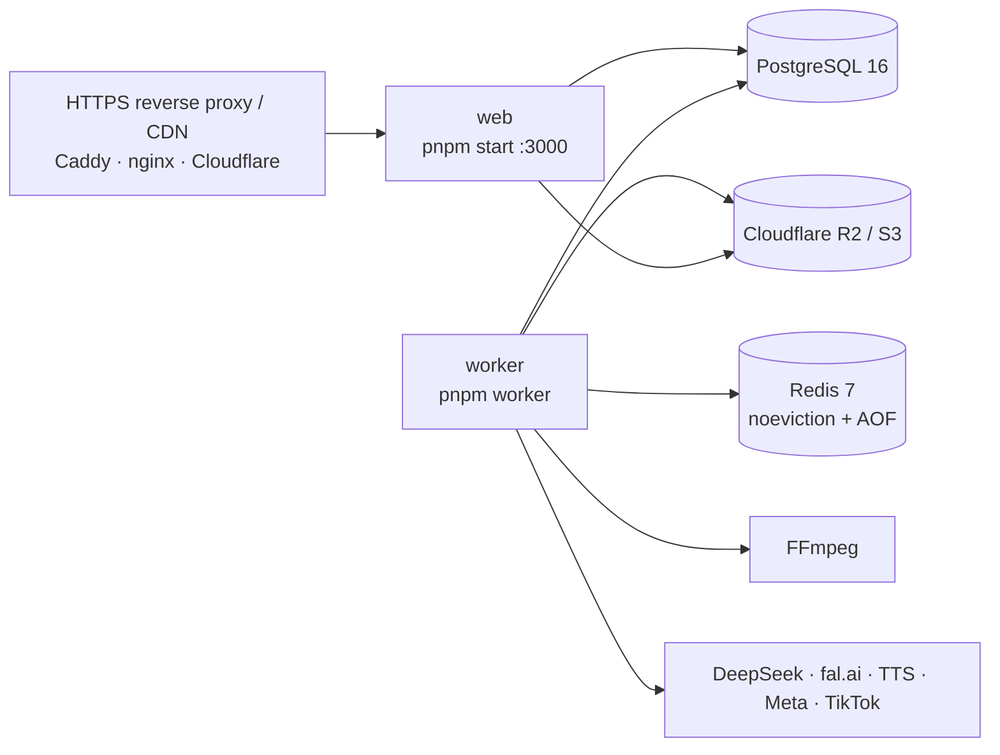

# Deployment

The system is two Node.js processes (web + worker) around PostgreSQL, Redis, FFmpeg and object storage. A single
small VPS is enough to start; the render queue is the first thing to scale.



> Verified in this repository: `pnpm build` + `pnpm start` (production Next.js server), the worker against local
> PostgreSQL + Redis (BullMQ), migrations, seed and the mock pipeline end to end. Not verified: a deployment on a
> real server, container images, real S3/R2 buckets and live social APIs.

## Requirements

| Component  | Version / notes                                                                                                 |
| ---------- | --------------------------------------------------------------------------------------------------------------- |
| Node.js    | ≥ 22.12 (uses `process.loadEnvFile`, JSON source-text parsing)                                                  |
| pnpm       | 10 (`corepack enable`)                                                                                          |
| FFmpeg     | 6+ with `libx264`, `libass`, `libfreetype` (flite optional for local speech); `ffprobe` alongside               |
| PostgreSQL | 16                                                                                                              |
| Redis      | 7, `maxmemory-policy noeviction`, AOF on (BullMQ requirement)                                                   |
| Storage    | Cloudflare R2 (recommended), AWS S3 or MinIO — required for real publishing (platforms pull media)              |
| Fonts      | Templates use **Inter** (install it, e.g. `fonts-inter`); fontconfig falls back to the system default otherwise |

Sizing: on a 4-vCPU machine a complete mock-mode run of one ~30 s 1080×1920 video (asset generation, render,
QA, variants) took about a minute with `RENDER_PRESET=veryfast`. Keep `RENDER_CONCURRENCY=1` on small machines;
rendering is CPU-bound.

## Local development

```bash
corepack enable
pnpm install                 # also generates the Prisma client
cp .env.example .env         # safe defaults: mocks on, publishing off
docker compose up -d         # PostgreSQL + Redis (add --profile s3 for MinIO)
pnpm db:migrate
pnpm db:seed                 # owner account + Demo Beauty / Demo Tools / Demo SaaS
pnpm demo                    # end-to-end mock run, writes videos to .data/demo
pnpm dev                     # dashboard on http://localhost:3000
pnpm worker                  # background worker (separate terminal)
```

## Production setup (single server)

1. **Provision** PostgreSQL, Redis (private network only) and an R2 bucket with an API token limited to that
   bucket. For TikTok `PULL_FROM_URL`, serve the bucket through a custom domain you can verify in TikTok's
   developer portal.
2. **Install**: `git clone`, `corepack enable`, `pnpm install --frozen-lockfile`.
3. **Configure** `/path/to/app/.env` (the repo root `.env` is read by web, worker and CLI):

   ```bash
   NODE_ENV=production
   APP_URL=https://app.example.com          # public URL: tracking links, bio pages, OAuth redirects
   DATABASE_URL=postgresql://cre:…@db:5432/cre
   REDIS_URL=redis://redis:6379
   CREDENTIALS_ENCRYPTION_KEY=$(openssl rand -base64 32)
   TRACKING_HASH_SECRET=$(openssl rand -hex 32)
   STORAGE_DRIVER=s3
   S3_ENDPOINT=https://<account>.r2.cloudflarestorage.com
   S3_REGION=auto
   S3_BUCKET=cre-media
   S3_ACCESS_KEY_ID=…
   S3_SECRET_ACCESS_KEY=…
   SEED_OWNER_EMAIL=you@example.com
   SEED_OWNER_PASSWORD=<long random password>
   # keep MOCK_* = true and PUBLISHING_ENABLED=false until each provider is configured and tested
   ```

4. **Database**: `pnpm db:migrate` (runs `prisma migrate deploy`), then `pnpm db:seed` once to create the owner.
   The seed also creates the three demo brands with mock accounts — pause them on `/brands/[id]` or keep them
   as a sandbox. The seed is idempotent.
5. **Build and run** the web app: `pnpm build`, then `pnpm start` (port 3000) behind the HTTPS proxy.
6. **Run the worker**: `pnpm worker`. It logs its safety configuration (mock flags, publishing switch, hard
   budget cap, providers) on start-up — check it.
7. **Health check**: `GET /api/health` → `{ ok, database, mock, publishingEnabled }` (503 when the database is
   unreachable).

### systemd units (example)

```ini
# /etc/systemd/system/cre-web.service
[Unit]
Description=Content Revenue Engine — web
After=network.target

[Service]
WorkingDirectory=/srv/cre
ExecStart=/usr/bin/env pnpm start
Restart=always
User=cre
Environment=PORT=3000

[Install]
WantedBy=multi-user.target
```

```ini
# /etc/systemd/system/cre-worker.service
[Unit]
Description=Content Revenue Engine — worker
After=network.target

[Service]
WorkingDirectory=/srv/cre
ExecStart=/usr/bin/env pnpm worker
Restart=always
User=cre
# graceful shutdown: running jobs get up to 25 s to finish
KillSignal=SIGTERM
TimeoutStopSec=40

[Install]
WantedBy=multi-user.target
```

### Reverse proxy

Terminate TLS in front of the web app and pass the client address:

```caddy
app.example.com {
    reverse_proxy 127.0.0.1:3000
}
```

Caddy sets `X-Forwarded-For`, which the click-flood limiter and visitor hashing rely on. Behind Cloudflare, the
`CF-IPCountry` header provides the click country. Make sure the proxy overwrites (not appends to) a client-sent
`X-Forwarded-For` if the app is reachable directly.

## Scaling

| Pressure              | Action                                                                                        |
| --------------------- | --------------------------------------------------------------------------------------------- |
| Render backlog        | Run extra render workers: `WORKER_QUEUES=render RENDER_CONCURRENCY=1 pnpm worker` on more CPU |
| Many API-bound jobs   | Raise `WORKER_CONCURRENCY` (default 4) for the non-render queues                              |
| Several web instances | Move login / click rate limits to a shared store (they are in-memory per process)             |
| Job dispatch latency  | `DISPATCHER_POLL_MS` (default 1000 ms)                                                        |

Several workers can run at once: due jobs are claimed with `FOR UPDATE SKIP LOCKED`, every handler is idempotent
and the maintenance tick is de-duplicated per minute.

## Going from mock to real — one switch at a time

Each step is reversible and budget-guarded. Set small budgets first (`/brands/[id]` and the workspace budget).

1. `MOCK_AI=false` + `DEEPSEEK_API_KEY` → run one ideation; compare `/costs` with DeepSeek's usage page.
2. `MOCK_MEDIA=false` + `FAL_KEY` (+ `TTS_PROVIDER` key if voice-over is used) → produce one Tier 0 item; check
   the recorded cost against fal's dashboard.
3. `MOCK_SOCIAL=false`, connect accounts via OAuth (see [SOCIAL_APIS.md](SOCIAL_APIS.md)).
4. Only when you intend to post publicly: `PUBLISHING_ENABLED=true`; start with TikTok `SELF_ONLY` and a test
   Page/Instagram account.

`HARD_DAILY_BUDGET_USD` (default $5) caps real spend per UTC day across the whole system regardless of database
budgets.

## Operations

- **Logs**: structured JSON (pino) on stdout with `runId`, `brandId`, `contentId`, `jobId` and
  `START / SUCCESS / FAILURE / RETRY / COST` events; collect with journald or your log stack.
- **Failures**: `/jobs` (failed, dead-lettered, budget-blocked jobs with their timeline and one-click retry);
  the dashboard header shows the failed-job count.
- **Backups**: PostgreSQL (all state, money, analytics, provenance) and the media bucket (assets and renders
  live only there).
- **Upgrades**: `git pull && pnpm install --frozen-lockfile && pnpm db:migrate && pnpm build`, then restart web
  and worker.
- **Data retention**: clicks contain no raw IPs or user agents; delete old clicks/snapshots with SQL if your
  policy requires shorter retention.

## Containers

`docker-compose.yml` provides PostgreSQL, Redis and (profile `s3`) MinIO for development. Application images
are not provided; if you containerise web and worker, the worker image needs FFmpeg with libass/libx264 and
fonts, and both need the repository root `.env` (or the same variables in the environment).
