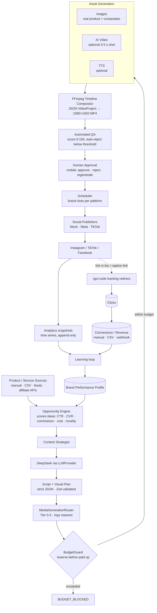
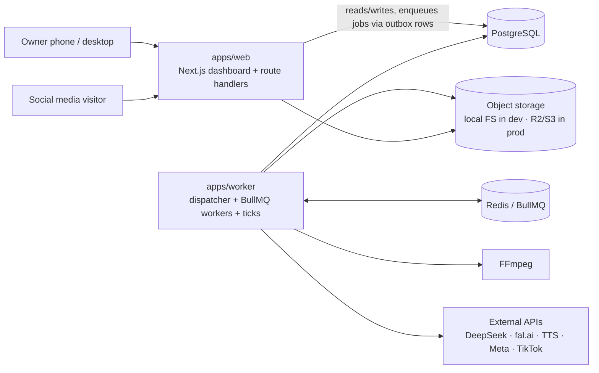
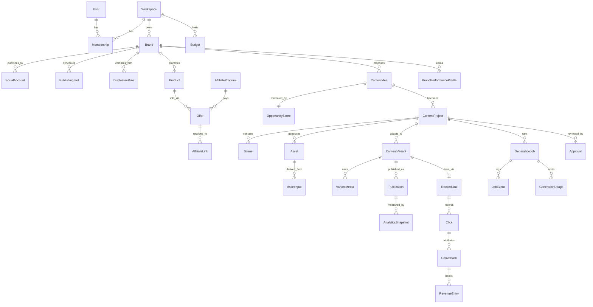
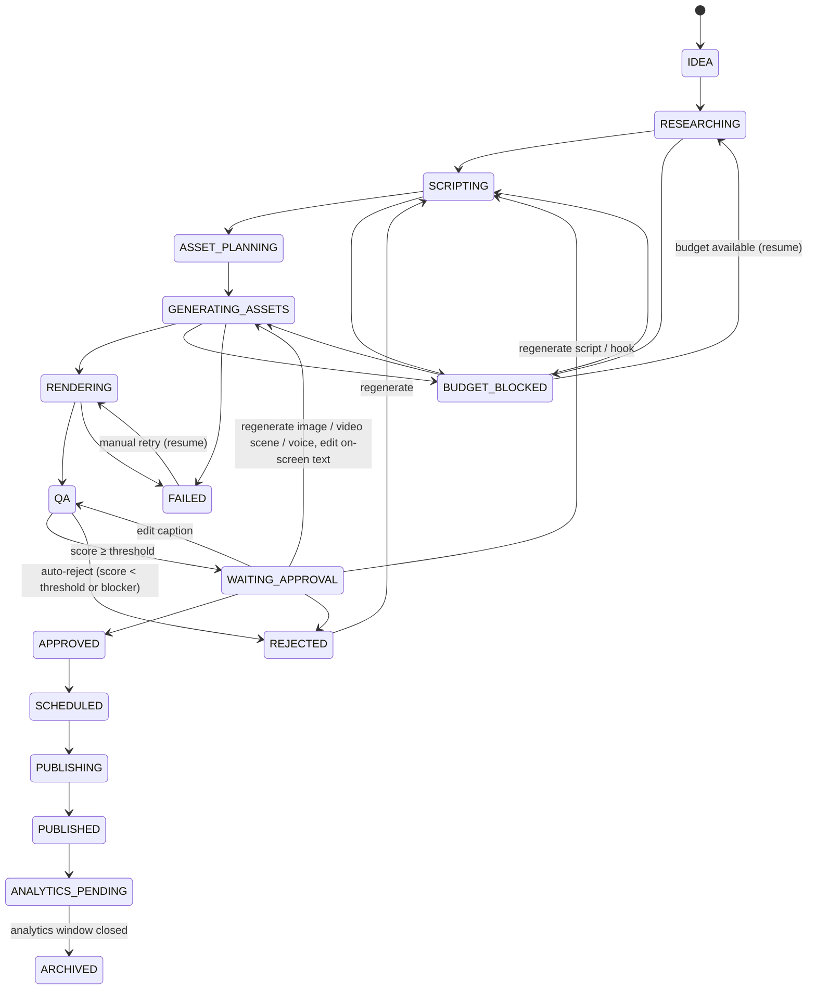
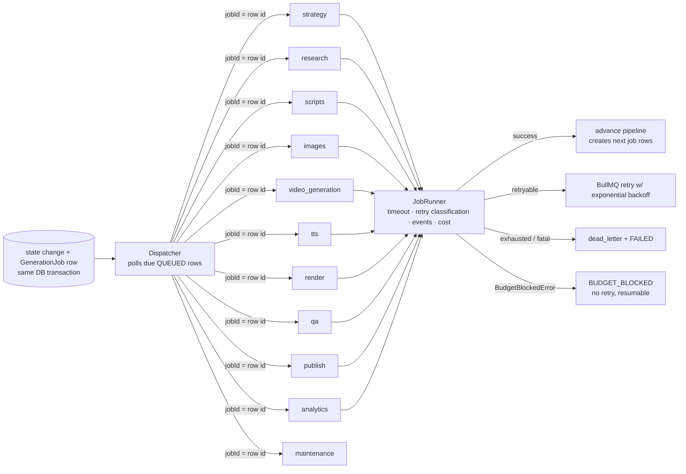

# Content Revenue Engine — Implementation Plan

> Status: living document. Written at Phase 0 (repository inspection) and updated as phases land — all phases
> are implemented (see section I); the current architecture is described in `docs/ARCHITECTURE.md`.
> The goal is **CONTENT → ATTENTION → CLICK → CONVERSION → REVENUE**. Every component below exists to
> move content along that chain at the lowest possible cost and to _measure_ whether it did.

## 0. Repository inspection (Phase 0 findings)

| Finding                                                                                                                                                                           | Consequence                                                                                                                                                                                                   |
| --------------------------------------------------------------------------------------------------------------------------------------------------------------------------------- | ------------------------------------------------------------------------------------------------------------------------------------------------------------------------------------------------------------- |
| Repository was empty (no commits, no branches on remote).                                                                                                                         | Greenfield. No existing work to preserve, no architecture conflicts.                                                                                                                                          |
| Toolchain available: Node 22, pnpm 10, FFmpeg 6.1 (libx264, libass, freetype, flite, xfade, zoompan, gradients), PostgreSQL 16, Redis 7.                                          | Use the suggested stack. FFmpeg filters required by the compositor are all present.                                                                                                                           |
| Current package versions (Oct 2026): Next 16.4, React 19.3, Prisma 7.10 (CLI `latest` tag points at an RC), TypeScript 7.0 (native), typescript-eslint 8.71 (supports TS `<6.1`). | Pin **TypeScript 5.9.3** (tooling compatibility) and **Prisma 7.10.0** (stable). Prisma 7 requires a driver adapter (`@prisma/adapter-pg`) and `prisma.config.ts`; the generated client is TypeScript source. |
| Docker CLI present but no daemon in the build sandbox.                                                                                                                            | `docker-compose.yml` is provided for local use; verification in this environment runs against natively started Postgres/Redis.                                                                                |

Architecture conflicts found: **none** (new project). Decisions that deviate from the brief are listed in
section L ("Decisions & deviations").

---

## A. Architecture



**Runtime topology** (deliberately boring):



Key architectural choices:

1. **Two processes, one database.** `web` never runs heavy work. It writes state + job rows; `worker` executes.
2. **Transactional outbox for jobs.** A job is a `GenerationJob` row created in the _same transaction_ as the
   state change that requires it (e.g. "approve + schedule"). The worker's dispatcher pushes due rows into BullMQ
   using the row id as the BullMQ `jobId` (deduplication). Redis loss never loses work; a restart never duplicates it.
   The web app does not need Redis at all.
3. **Idempotency at three levels**: (a) job rows keyed by `idempotencyKey`; (b) assets keyed by a content hash of
   their inputs (`Asset.idempotencyKey`) — a READY asset is reused instead of paying again, and async provider
   requests store `externalJobId` so a restarted worker _polls_ instead of re-submitting; (c) cost ledger rows keyed
   by `GenerationUsage.idempotencyKey`.
4. **Explicit state machines** for `ContentProject`, `ContentVariant` and `Publication` — no boolean workflow flags.
5. **Providers behind interfaces** chosen by configuration (`packages/config`), never by `if (provider === "x")`
   scattered in business code. Every provider exposes `healthCheck`, `estimateCost`, `execute`.
6. **Money is exact**: `Decimal(18,6)` USD in Postgres, integer micro-dollars in application math.
7. **Estimates are stored separately from actuals** (`OpportunityScore` vs `AnalyticsSnapshot`/`RevenueEntry`;
   `estimatedCostUsd` vs `actualCostUsd`).
8. **Mock mode is a first-class driver**, not a test hack: `MOCK_AI`, `MOCK_MEDIA`, `MOCK_SOCIAL` swap providers
   for local, free implementations that still produce real files (FFmpeg-generated images, clips, speech via flite,
   procedural music) so the _real_ compositor, QA and dashboard run in mock mode.

## B. Repository structure

```
apps/
  web/          Next.js 16 App Router — dashboard, approval UI, /go/:code redirects,
                media streaming (Range support), webhooks, OAuth callbacks, public bio pages
  worker/       Job dispatcher, BullMQ workers per queue, maintenance ticks, CLI scripts (demo, strategy run)
packages/
  shared/       money (micro-USD), ids, errors (retryable/fatal/budget), logger (pino), hashing, text similarity, time periods
  config/       env schema (Zod), provider configuration, pricing catalog, tier → model mapping
  db/           Prisma schema, migrations, client factory, seed (Demo Beauty / Demo Tools / Demo SaaS)
  ai/           LLMProvider interface; DeepSeek (OpenAI-compatible base) + Mock; versioned prompt registry;
                structured generation (Zod validation + repair retries)
  providers/    Image / Video / TTS / BackgroundRemoval / Storage providers (+ mocks), provider registry
  media/        VideoProject schema, FFmpeg timeline compositor, ASS kinetic typography, ffprobe/QA probes,
                programmatic generators (gradients, product cards, music beds)
  publishing/   SocialPublisher interface; Mock, Meta (IG/FB), TikTok adapters; OAuth helpers; platform limits
  analytics/    pure metric math (CTR, RPM, ROI, profit), latest-snapshot aggregation, performance profile extraction
  core/         domain services: state machines, cost ledger, BudgetGuard, MediaGenerationRouter, opportunity scoring,
                text QA, approval/regeneration commands, scheduler, tracking links, revenue import, job outbox, read models
  pipeline/     step executors (ideation, research, script, asset planning, asset generation, render, QA, publish,
                analytics), job runner (timeouts, retry classification, dead-letter), BullMQ + inline dispatchers
docs/           architecture, pipeline, providers, cost model, deployment, social APIs, security
```

Dependency direction (no cycles): `shared ← config ← db ← analytics ← core ← pipeline ← worker`;
`ai`, `providers`, `media`, `publishing` depend only on `shared`/`config`; `web` depends on `core` (+ `publishing` for OAuth).

Internal packages are consumed as TypeScript source (`exports: ./src/index.ts`); Next.js transpiles them and the
worker runs under `tsx`. No build step is needed for development.

## C. Data model

PostgreSQL via Prisma 7. Large media never goes into Postgres — only storage keys + provenance.



Entity groups (full definitions in `packages/db/prisma/schema.prisma`):

| Group        | Entities                                                                                                                                              | Notes                                                                                                                                                           |
| ------------ | ----------------------------------------------------------------------------------------------------------------------------------------------------- | --------------------------------------------------------------------------------------------------------------------------------------------------------------- |
| Identity     | `User`, `Session`, `Workspace`, `Membership`                                                                                                          | Server-side sessions (hashed tokens). Every query is scoped by workspace membership.                                                                            |
| Brand        | `Brand`, `SocialAccount`, `PublishingSlot`, `DisclosureRule`, `Template`, `BrandPerformanceProfile`                                                   | Brand holds voice, visual identity, rules, banned words, compliance notes, monetization models, QA threshold, tier ceiling.                                     |
| Commerce     | `AffiliateProgram`, `Product`, `Offer`, `AffiliateLink`                                                                                               | Products carry `facts` (claim + source) — the only claims generation may use. `AffiliateProgram.redirectPolicy` handles programs that forbid redirect/cloaking. |
| Content      | `ContentIdea`, `OpportunityScore`, `ContentProject` (master creative), `Scene`, `Asset`, `AssetInput`, `ContentVariant`, `VariantMedia`, `Experiment` | Idea ≠ assets ≠ platform variant ≠ publication.                                                                                                                 |
| Workflow     | `PipelineRun`, `GenerationJob`, `JobEvent`, `Approval`, `AuditLog`, `PromptVersion`                                                                   | `JobEvent` powers the dashboard timeline.                                                                                                                       |
| Distribution | `Publication`, `AnalyticsSnapshot`                                                                                                                    | Snapshots are append-only time series (cumulative metrics → aggregate the _latest_ per publication).                                                            |
| Money        | `GenerationUsage`, `Budget`, `TrackedLink`, `Click`, `Conversion`, `RevenueEntry`, `Expense`, `ProviderCredential`                                    | Usage rows are RESERVED → COMMITTED/RELEASED. Credentials encrypted (AES-256-GCM).                                                                              |

Conventions: `cuid` ids; `createdAt`/`updatedAt`; money `Decimal(18,6)` in USD (+ original currency for revenue);
`isSimulated`/`isMock` flags so mock data can never be confused with real money.

## D. Pipeline state machine

`ContentProject.status` (the master creative):



(Every working state can go to `FAILED`/`BUDGET_BLOCKED`, both remember `resumeStatus`; most states can go to
`ARCHIVED`. The authoritative transition table lives in `packages/core/src/lifecycle/` and is unit tested.)

Transitions are applied with optimistic concurrency: `UPDATE … WHERE id = $1 AND status = $from`; zero rows
updated ⇒ `StateConflictError` (another actor moved it). Every transition writes an `AuditLog` row.

`ContentVariant`: `PENDING → READY → APPROVED | REJECTED | SKIPPED → SCHEDULED → PUBLISHING → PUBLISHED | FAILED`.
`Publication`: `SCHEDULED → PUBLISHING → PUBLISHED | FAILED → (retry) SCHEDULED | CANCELLED`.
`GenerationJob`: `QUEUED → DISPATCHED → RUNNING → SUCCEEDED | RETRYING | FAILED → DEAD_LETTER | BUDGET_BLOCKED | CANCELLED`.

Approval is project-level (default: approve all platform variants) with optional per-variant exclusion.
`ANALYTICS_PENDING` = published and inside the analytics collection window; after the window the item is `ARCHIVED`
with its metrics frozen.

## E. Provider interfaces

All providers share `BaseProvider { name; kind; isMock; healthCheck(); estimateCost(request) }` plus `execute`.

| Interface                   | Methods                                                                                          | MVP implementations                                                                                               | Later                                                                                  |
| --------------------------- | ------------------------------------------------------------------------------------------------ | ----------------------------------------------------------------------------------------------------------------- | -------------------------------------------------------------------------------------- |
| `LLMProvider`               | `generateText`, `generateStructured<T>(zod)`, `classify`, `score`, `execute`                     | `MockLLMProvider`, `DeepSeekProvider` (OpenAI-compatible base)                                                    | OpenAI, Anthropic, Gemini, local (any OpenAI-compatible endpoint works via base class) |
| `ImageProvider`             | `execute({prompt, size, model, seed, referenceImage})`                                           | `MockImageProvider` (FFmpeg-generated), `FalImageProvider` (FLUX)                                                 | Runware, Replicate, ComfyUI                                                            |
| `BackgroundRemovalProvider` | `execute({imagePath})`                                                                           | Mock (pass-through / colour key), `FalBackgroundRemoval`                                                          | self-hosted rembg                                                                      |
| `VideoGenerationProvider`   | `submit`, `poll`, `execute` (image-to-video, 3-5 s)                                              | `MockVideoProvider` (FFmpeg motion clip), `FalVideoProvider` (Kling/Hailuo/Wan via fal)                           | Runware, ComfyUI                                                                       |
| `TTSProvider`               | `execute({text, voice, language}) → audio + word timings`                                        | `MockTTSProvider` (FFmpeg flite speech / silence), `OpenAITTSProvider`, `ElevenLabsTTSProvider` (with timestamps) | Edge TTS, others                                                                       |
| `StorageProvider`           | `put`, `putFile`, `getLocalPath`, `createReadStream`, `stat`, `exists`, `delete`, `getSignedUrl` | `LocalStorageProvider`, `S3StorageProvider` (R2-compatible)                                                       | —                                                                                      |
| `SocialPublisher`           | `publish`, `schedule`, `getStatus`, `getAnalytics`, `healthCheck`, `validate`                    | `MockSocialPublisher`, `MetaPublisher` (IG Reels/FB), `TikTokPublisher` (Content Posting API)                     | YouTube Shorts, Pinterest, X, LinkedIn                                                 |

Selection is configuration-driven (`packages/config/src/providers.ts`): `MOCK_AI`, `MOCK_MEDIA`, `MOCK_SOCIAL` force
mocks; otherwise `LLM_PROVIDER`, `IMAGE_PROVIDER`, … pick implementations, and the tier → model map picks models.

Prompts are versioned modules under `packages/ai/src/prompts/{strategy,hooks,script,caption,qa,scoring}`; each
generation logs its `PromptVersion` id. LLM responses are strict JSON validated with Zod; invalid output triggers
a bounded repair loop that feeds the validation errors back to the model.

## F. Queue architecture



- **Retry**: BullMQ attempts + exponential backoff per queue; errors are classified (`RetryableError` for timeouts,
  429, 5xx; `FatalError` for 4xx/auth/validation; `BudgetBlockedError` never retried).
- **Timeout**: per job type, enforced with `AbortController` (provider calls receive the signal).
- **Dead-letter**: final failures are copied to the `dead_letter` queue and the DB row becomes `DEAD_LETTER`;
  the dashboard offers manual retry.
- **Idempotency**: see A.3. Fan-out (one job per asset) and fan-in (render starts when all assets are READY) use a
  row lock on the project to avoid double-advancing.
- **Status & structured logs**: every job logs `START/SUCCESS/FAILURE/RETRY/COST` with `runId`, `brandId`,
  `contentId`, `jobId` (pino JSON) and mirrors them into `JobEvent` for the dashboard timeline.
- **Inline dispatcher**: same processors executed in-process — used by tests and `pnpm demo` (no Redis required).
- **Ticks** (maintenance queue / interval): publish due publications, collect analytics, resume budget-blocked work
  when a new budget period starts, reconcile stale cost reservations, rebuild performance profiles.

## G. Cost-control architecture

1. **Estimate before execute.** Every paid call goes through `CostLedger.withReservation()`:
   `estimateCost()` → `BudgetGuard.reserve()` → provider `execute()` → `commit(actual)` or `release()`.
2. **BudgetGuard** checks, inside a transaction holding a Postgres advisory lock per workspace:
   brand daily/weekly/monthly, global daily/monthly, per-content cap, per-content AI-video cap.
   Spend = COMMITTED (actual if known, else estimate) + outstanding RESERVED estimates.
   If any limit would be exceeded the paid operation **does not run**; the job and the project move to
   `BUDGET_BLOCKED` with machine-readable reasons shown on the dashboard. `maxRegenerations` caps regeneration.
3. **MediaGenerationRouter** picks Tier 0-3 from: performance evidence (UNPROVEN → PROMISING → HIGH → PROVEN_WINNER),
   requested quality, brand tier ceiling / AI-video permission, expected value (cost must stay below a configurable
   share of expected value), remaining budget and per-content caps. It downgrades until the plan fits and records
   every reason. Tier 3 requires proven analytics — never spent on unvalidated ideas.
4. **Reuse before regenerate.** Assets are content-addressed; regeneration is scoped (hook/caption/script/image/
   video scene/voice) and only invalidates what changed. Scene clips are cached by hash so a text edit re-renders
   only the final pass. A/B tests vary cheap variables (hook, CTA, caption, cover, first 3 s) on shared assets.
5. **Pricing catalog** (`packages/config/src/pricing.ts`) holds per-provider/model unit prices with an
   "as of" date; values are estimates to be verified against invoices (`actualCostUsd` when providers report it).
6. **Reporting**: cost per content / approved / published / conversion, revenue ÷ cost, ROI, profit
   (revenue − AI cost − infrastructure − ad spend).

Target: ≤ $0.50 per accepted short video. Expected: Tier 0 ≈ $0.02–0.08, Tier 1 ≈ $0.25–0.40 (see `docs/COST_MODEL.md`).

## H. Security model

- Secrets only in environment variables; `.env.example` documents them; `.env*` git-ignored.
- Third-party credentials (OAuth tokens, API keys entered in the UI) encrypted at rest with AES-256-GCM
  (`CREDENTIALS_ENCRYPTION_KEY`, key version stored for rotation). Tokens never reach the browser.
- Authentication: scrypt password hashes, random session tokens stored as SHA-256 hashes, `httpOnly` + `secure` +
  `SameSite=Lax` cookies. Authorization is server-side on every page, action and route (workspace membership).
- Input validation with Zod for every server action, route handler, webhook and CSV import.
- Click tracking stores no raw IP and no full user agent: device/OS/browser families, referrer host, CDN country
  header, and a daily-rotating salted visitor hash for de-duplication.
- Webhooks authenticated by per-program secrets (timing-safe compare); payload size limits; rate limits on `/go`.
- Safety switches: `MOCK_*` default to `true`; `PUBLISHING_ENABLED=false` blocks any real publication even with
  credentials; budgets block paid calls; real publishing requires an approved item.
- Compliance: per-brand/per-platform disclosure rules are enforced by QA (missing disclosure = blocker);
  generation is restricted to stored product facts; fake reviews/testimonials are prohibited in prompts and QA.

## I. Development phases

| Phase | Scope                                                                                                                                | Status | Notes                                                                                        |
| ----- | ------------------------------------------------------------------------------------------------------------------------------------ | ------ | -------------------------------------------------------------------------------------------- |
| 0     | Repository inspection, this plan, monorepo scaffold, tooling                                                                         | done   |                                                                                              |
| 1     | Core schema + migrations + seed, shared/config packages, state machines                                                              | done   |                                                                                              |
| 2     | Mock pipeline end-to-end: providers + mocks, cost ledger, BudgetGuard, router, prompts, strategy, QA, inline dispatcher, `pnpm demo` | done   | Integration tests against PostgreSQL + FFmpeg                                                |
| 3     | Approval dashboard (mobile-first) + dashboard pages + tracking redirect                                                              | done   | All pages of the brief + `/revenue`; verified with a production build and browser automation |
| 4     | FFmpeg rendering engine (timeline, motion, transitions, typography, subtitles, audio)                                                | done   | Executed before phase 3                                                                      |
| 5     | DeepSeek integration (real adapter, pricing, health check)                                                                           | done*  |                                                                                              |
| 6     | Real image provider (fal.ai FLUX) + background removal + compositing                                                                 | done*  |                                                                                              |
| 7     | Optional TTS (OpenAI / ElevenLabs with timestamps)                                                                                   | done*  |                                                                                              |
| 8     | Optional AI video (fal.ai image-to-video)                                                                                            | done*  |                                                                                              |
| 9     | Meta / TikTok publishing adapters + OAuth + encrypted credentials                                                                    | done*  |                                                                                              |
| 10    | Analytics collection loop (snapshots, windows)                                                                                       | done   | Real collection via the adapters is unverified (*)                                           |
| 11    | Revenue tracking (conversions: manual, CSV, webhook; revenue entries; expenses)                                                      | done   |                                                                                              |
| 12    | Optimization engine (performance profile → prompts, router evidence, experiments)                                                    | done   | Hook / caption A/B tests on shared assets                                                    |

\* Implemented against the providers' documented APIs and tested with scripted HTTP responses only. No live API
was called during development (no keys, no spend) — see `docs/PROVIDERS.md` and `docs/SOCIAL_APIS.md` for the
verification checklist before enabling them.

**First milestone (vertical slice)** — reached: one brand + one product → idea → mock DeepSeek → assets → 20-30 s
1080×1920 video rendered by FFmpeg → QA → approval queue → APPROVE → mock scheduled publication → mock analytics
→ dashboard shows impressions, clicks, revenue, generation cost and profit. All in mock mode, zero spend
(`pnpm demo`).

## J. Definition of Done — Phase 1

- `pnpm install` works from a clean checkout; `docker compose up -d` (or native services) provides Postgres + Redis.
- `pnpm db:migrate` applies the initial migration; `pnpm db:seed` creates a workspace, an owner user, the brands
  **Demo Beauty**, **Demo Tools**, **Demo SaaS**, products with sourced facts, affiliate programs/offers/links,
  budgets, publishing slots (TikTok 12:00, Instagram 15:00, Facebook 18:00), disclosure rules and mock social accounts.
- State machine transition tables for project/variant/publication/job are implemented and unit tested
  (valid and invalid transitions, resume behaviour).
- `pnpm typecheck`, `pnpm lint`, `pnpm test` pass.
- Architecture documentation exists (this file + `docs/ARCHITECTURE.md`).

## K. Known risks

| Risk                                                                                                                                                      | Impact                      | Mitigation                                                                                                                                                               |
| --------------------------------------------------------------------------------------------------------------------------------------------------------- | --------------------------- | ------------------------------------------------------------------------------------------------------------------------------------------------------------------------ |
| Platform API access: Meta app review; TikTok unaudited apps may only post `SELF_ONLY` (private); IG requires a Business/Creator account linked to a Page. | Real publishing delayed.    | Mock publisher end-to-end now; adapters isolated; `docs/SOCIAL_APIS.md` lists the review steps.                                                                          |
| Instagram/TikTok captions do not carry clickable links.                                                                                                   | Clicks depend on bio links. | Public per-brand bio page (`/b/:brand`) with per-content tracked links; Facebook captions carry the link directly.                                                       |
| Affiliate program terms (e.g. some forbid redirect/cloaked links or require specific disclosures).                                                        | Account termination.        | `AffiliateProgram.redirectPolicy = DIRECT_LINK_ONLY` uses the raw affiliate link (attribution via tracking/sub IDs); disclosure rules per brand/platform enforced by QA. |
| Generative models hallucinate logos/packaging.                                                                                                            | Misrepresenting products.   | Composite real product imagery; generated images only for scenes/backgrounds; provenance recorded per asset.                                                             |
| Unsupported or false claims.                                                                                                                              | Legal/compliance exposure.  | Generation constrained to stored product facts; QA flags claims not backed by facts and banned words; human approval.                                                    |
| AI-content labelling rules (TikTok AIGC label, Meta "AI info").                                                                                           | Post removal.               | Variant carries an `aiGenerated` flag; adapters set platform labels where the API supports it.                                                                           |
| Pricing drift between catalog estimates and invoices.                                                                                                     | Budgets inaccurate.         | Pricing catalog with "as of" dates, `actualCostUsd` when reported, reconciliation of stale reservations, conservative defaults.                                          |
| FFmpeg render time on small servers.                                                                                                                      | Throughput.                 | Scene cache, low render concurrency, `veryfast` preset, renders off the request path.                                                                                    |
| LLM JSON reliability/timeouts.                                                                                                                            | Failed steps.               | JSON mode + Zod + repair loop + retries with backoff; deterministic fallbacks where safe.                                                                                |
| Music/stock licensing.                                                                                                                                    | Copyright strikes.          | Default to procedural/licensed audio only; asset provenance stores license metadata.                                                                                     |
| Privacy (GDPR/ePrivacy) for click tracking.                                                                                                               | Regulatory.                 | Data minimisation (no raw IP/UA), hashed visitor ids with rotating salts, retention policy documented.                                                                   |
| Prisma 7 is new (TS-source client, driver adapters).                                                                                                      | Tooling surprises.          | Verified in this environment during Phase 0; versions pinned.                                                                                                            |

## L. Decisions & deviations

- **Extra packages `core` and `pipeline`** beyond the suggested list: `core` holds domain logic the web app needs
  (approval, budgets, read models) without pulling in FFmpeg/provider code; `pipeline` holds step executors used
  only by the worker.
- **Outbox-dispatched jobs** instead of enqueueing to Redis from HTTP handlers (atomicity + idempotency).
- **Brand identity and voice live on `Brand`**; learned behaviour lives in versioned `BrandPerformanceProfile` rows
  (the brief's "BrandProfile").
- **Products belong to one brand** (simplest correct model); cross-brand sharing can be added with a join table.
- **Text overlays are rendered with libass (ASS subtitles)** — kinetic typography (pop, slide, karaoke word
  highlight), automatic wrapping, safe margins — instead of dozens of `drawtext` filters.
- **A/B experiments vary one cheap variable on shared assets**: an alternative on-screen hook (final-pass
  re-render) for brands without voice-over, or an alternative caption opening for brands with voice-over (so the
  narration never contradicts the screen). Winners need ≥ 300 impressions per arm and ≥ 10% CTR lift.
- **Budgets apply to simulated costs in mock mode** (so blocking and tier downgrades can be tested for free); the
  system-wide hard cap counts real money only.
- **TikTok posts are private by default** (`TIKTOK_PRIVACY_LEVEL=SELF_ONLY`); commercial-content toggles are set
  per post on visible posts.
- **Conversion payloads are redacted** before storage (buyer e-mail, names, IPs, customer ids), and `/go` limits
  recorded clicks per visitor IP and link to resist click floods.
- **Application container images are not provided**: Docker Compose covers development services; the documented
  production path runs web and worker as Node processes (verified), see `docs/DEPLOYMENT.md`.
