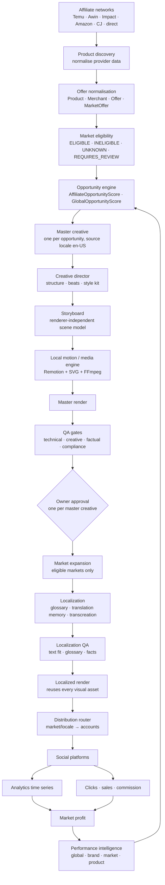

# Next phase — global affiliate engine, Creative Engine V2

> Status: living document, written after a full audit of the repository (October 2026) and updated as phases land.
> Goal of the next phase: evolve the existing single-market MVP into a **global, multi-brand, multi-market,
> multilingual affiliate content → distribution → analytics → revenue engine** with a strict
> **local-first / deterministic-first / low-cost** architecture — without rebuilding what already works.

## Target architecture

**Principle:** maximise expected profit per unit of content-production cost. One master creative → many markets.
Local code first, cache second, reuse third, LLM only for semantic work.

## 1. What already works (verified)

Verified with unit tests (213), integration tests against PostgreSQL + FFmpeg (16), `pnpm demo` and browser checks:

| Area               | What exists                                                                                                                                                                                                                                                                                                                  | Where                                               |
| ------------------ | ---------------------------------------------------------------------------------------------------------------------------------------------------------------------------------------------------------------------------------------------------------------------------------------------------------------------------- | --------------------------------------------------- |
| Monorepo & tooling | pnpm workspaces, strict TypeScript, ESLint, Prettier, Vitest (unit + integration)                                                                                                                                                                                                                                            | root                                                |
| Data model         | 39 models / 46 enums: brands, products (with sourced facts), offers, affiliate programs/links, ideas, opportunity scores, projects, scenes, assets with provenance, platform variants, experiments, jobs, usage ledger, budgets, publications, snapshots, tracked links, clicks, conversions, revenue, expenses, credentials | `packages/db`                                       |
| Jobs               | Transactional outbox, idempotent handlers, retries/backoff, dead letter, budget-blocked parking, BullMQ transport, inline dispatcher with simulated clock, job timeline events                                                                                                                                               | `packages/pipeline`, `packages/core/jobs`           |
| Money              | CostLedger (estimate → reserve → execute → commit/release), BudgetGuard (brand/workspace periods, per-content and AI-video caps, regenerations, system hard cap), pricing catalog                                                                                                                                            | `packages/core/costs`, `packages/config/pricing.ts` |
| Routing            | Tier 0–3 router with evidence levels, expected-value gate, budget fit, recorded reasons                                                                                                                                                                                                                                      | `packages/core/routing`                             |
| LLM layer          | `LLMProvider` (DeepSeek, OpenAI-compatible, mock), versioned prompts with snapshot guard, JSON mode + Zod repair loop, usage + cache-hit pricing                                                                                                                                                                             | `packages/ai`                                       |
| V1 renderer        | JSON `VideoProject` → FFmpeg filtergraph compositor, libass kinetic typography, scene cache, music bed, whoosh, flite speech, probes                                                                                                                                                                                         | `packages/media`                                    |
| QA (V1)            | Text/compliance checks (claims vs facts, disclosures, prices, duplicates, placeholders), media probes (resolution, duration, black, freeze, loudness), score 0–100, one auto-fix                                                                                                                                             | `packages/core/qa`, `pipeline/steps/qa.ts`          |
| Approval           | Approve (subset of variants), reject with reasons, scoped regeneration, text edits with caption lock                                                                                                                                                                                                                         | `packages/core/approval`                            |
| Distribution       | Brand slots, scheduler, mock publisher, Meta/TikTok adapters (stub-tested), OAuth, kill switch, reconnect flag                                                                                                                                                                                                               | `packages/publishing`, `pipeline/steps/publish.ts`  |
| Measurement        | Append-only snapshots, `/go` redirect (privacy-minimised, flood guard), postbacks, CSV, attribution, profitability by brand/product/platform/content/day, learning profile, A/B experiments                                                                                                                                  | `packages/core`, `packages/analytics`               |
| UI                 | 13 dashboard pages (16 routes with login, bio page and root) incl. mobile approval, costs, analytics, revenue, jobs, providers                                                                                                                                                                                               | `apps/web`                                          |

## 2. What is partial

| Area                | Gap against the new specification                                                                                                                                                              |
| ------------------- | ---------------------------------------------------------------------------------------------------------------------------------------------------------------------------------------------- |
| Creative quality    | V1 videos are typographic cards on gradients/placeholder packshots — technically valid, commercially weak (spec §19–22).                                                                       |
| QA                  | One combined score; a correctly rendered file scores ~100 regardless of creative quality (spec §38). No visual-repetition, product-visibility or text-density checks; no ProductionReady gate. |
| Placeholder policy  | Placeholder product imagery is only an `info` issue in mock mode; nothing prevents "production ready" semantics (spec §44).                                                                    |
| Text fitting        | V1 `fitText` uses approximate Inter metrics, not real font metrics (spec §33).                                                                                                                 |
| Safe zones          | One union safe area; no per-platform definitions or validation of every text box (spec §34).                                                                                                   |
| Products & offers   | `Product` → `Offer` → `AffiliateLink(region)` exists, but no Merchant, no Market, no per-market price/currency/commission (spec §13).                                                          |
| Opportunity scoring | `heuristic-v1` is single-market and LLM-idea-centric; no provenance (OBSERVED/ESTIMATED/UNKNOWN), no global coverage (spec §15–17).                                                            |
| Localization        | `ContentProject.language = "en"`; no markets, locale packs, translation memory or glossary (spec §47–53).                                                                                      |
| LLM usage           | 4–5 calls per content (research, script, hook variants, captions, optional QA review); no output cache, no AI usage policy/audit (spec §6–7, §75–77).                                          |
| Voice               | TTS runs during asset generation, i.e. before approval (spec §56 wants it after approval).                                                                                                     |
| Accounts            | One account per platform per brand; no market/locale/strategy on `SocialAccount` (spec §59).                                                                                                   |

## 3. What is mock-only

Social publishing and metrics, clicks/conversions in the demo, product photos (FFmpeg packshots), AI images and
image-to-video (FFmpeg stills/motion clips), TTS (flite/silence), music (procedural), affiliate data (seed rows).
Real adapters (DeepSeek, fal.ai, OpenAI/ElevenLabs TTS, S3/R2, Meta, TikTok) are implemented but verified only
against scripted HTTP responses. No live API has been called.

## 4. What must change

1. **Creative Engine V2** — renderer-independent storyboard (visual beats + text slots), deterministic creative
   director, category style kits, typography system, real-metric text fitting, platform safe zones, subtitle
   engine, Remotion motion renderer, FFmpeg finishing, audio director.
2. **QA split and gates** — TechnicalQA, CreativeQA, FactualQA, ComplianceQA, LocalizationQA; CreativeQualityScore;
   placeholder policy; configurable thresholds; ProductionReady only when every gate passes.
3. **Master creative flow** — one approval per master; expansion to markets after approval; TTS after approval.
4. **Markets** — `Market` model (locale ≠ market), MarketOffer per market, eligibility engine.
5. **Localization** — LocalePack per market, glossary, translation memory, incremental transcreation, local
   currency/unit formatting.
6. **Affiliate architecture** — provider-neutral `AffiliateNetworkProvider`, Merchant/Offer/MarketOffer separation,
   discovery normalisation, mock providers (Temu, Awin, Impact, Amazon).
7. **Opportunity engine** — AffiliateOpportunityScore + GlobalOpportunityScore with explicit provenance and
   configurable thresholds.
8. **AI usage policy** — central gate (cache → reuse → budget → deterministic alternative → call), output cache,
   batching into one structured creative call, AI usage dashboard and audit (`/settings/ai-usage`).
9. **Distribution & analytics** — market/locale-aware accounts and router, per-market scheduling, market/network/
   merchant dimensions, market profit, performance profiles per market/product, winner escalation, stop-loss.

## 5. What remains unchanged

Job outbox/runner/dispatchers, CostLedger and BudgetGuard (extended with new cost categories, not replaced),
tracking redirect and attribution, revenue import, auth/security, dashboard shell, state-machine engine (new
machines are added with the same mechanism), provider interfaces (extended), V1 FFmpeg compositor (kept as the
renderer of existing projects and as a fallback; FFmpeg stays responsible for encoding, audio, normalisation and
inspection), tests, safety switches (`MOCK_*`, `PUBLISHING_ENABLED`, `HARD_DAILY_BUDGET_USD`).

## 6. Decisions

| Decision                         | Choice                                                                                                    | Why                                                                                                                                                                  |
| -------------------------------- | --------------------------------------------------------------------------------------------------------- | -------------------------------------------------------------------------------------------------------------------------------------------------------------------- |
| Motion renderer                  | **Remotion 4** for composition (React/SVG/CSS), FFmpeg for finishing                                      | Spec §25; the existing FFmpeg filtergraph is not an equally good motion system — more motion would mean unmaintainable filter strings.                               |
| Scene model                      | New `@cre/creative` package, no React/Node-only deps                                                      | Renderer independence (spec §25); the same model drives QA, localization and any future renderer.                                                                    |
| Renderer package                 | New `@cre/motion` (Remotion compositions + render driver)                                                 | Keeps React/Remotion out of the worker's other code paths.                                                                                                           |
| Fonts                            | OFL fonts from `@fontsource/*` packages; the same files feed the TextFitEngine (opentype.js) and Remotion | Deterministic text fitting = the renderer uses exactly the measured fonts.                                                                                           |
| Demo media                       | Parametric vector illustrations (React SVG) marked DEMO / NOT PRODUCTION; static SVG exports              | No real merchant media for benchmarks (spec §74); vector art stays crisp in macro shots.                                                                             |
| V1 renderer                      | Kept; selected per project (`renderSpec` reproducibility)                                                 | Never remove working functionality.                                                                                                                                  |
| ContentProject vs MasterCreative | `ContentProject` **is** the master creative; extended with V2 fields instead of a parallel table          | Avoids duplicating lifecycle, costs, jobs and approvals (spec §83 "do not duplicate"). Master states map onto RENDERING → QA → WAITING_APPROVAL → APPROVED/REJECTED. |
| Localized variants               | New `LocalizedCreativeVariant` between master and platform variants (`ContentVariant.localizedVariantId`) | One master → many markets → platform variants.                                                                                                                       |
| Migrations                       | Additive only (new tables, nullable columns, idempotent backfills)                                        | No destructive migration without approval.                                                                                                                           |

**Remotion licence.** Remotion is free for individuals, non-profits and companies with up to 3 employees; companies
with 4+ employees need a paid company licence. Development and evaluation are covered. If the business has 4+
employees, buying a licence is the owner's decision; the scene model is renderer-independent, so the backend
can be replaced.

## 7. Data model evolution (planned)

| Phase             | Additions (all additive)                                                                                                                                                                                                                                                         |
| ----------------- | -------------------------------------------------------------------------------------------------------------------------------------------------------------------------------------------------------------------------------------------------------------------------------- |
| B/F               | `CreativeRender` (storyboard JSON + hash, engine, renderer version, media, timings, flags, QA reports, AI tokens, external cost), `CreativeQualityScore` (factor scores, method, gates)                                                                                          |
| G                 | `ContentProject`: `creativeEngine`, `storyboard` (V2), `sourceLocale`, `creativeStructure`, `styleKit`, `productionReady`, `placeholderMedia`, QA gate summary; prompt `creative.master` (one batched call)                                                                      |
| H                 | `Market` (country, locale, language, currency, timezone, measurement system, formats, priority, enabled, availability/disclosure rules); seed of the 18 initial markets; `SocialAccount`: `primaryMarketId`, `primaryLocale`, `supportedMarkets`, `supportedLocales`, `strategy` |
| I/M               | `AffiliateNetwork`, `Merchant`, `MarketOffer` (product × merchant × market: price, currency, commission, shipping, availability, affiliate destination, freshness, eligibility status + reasons); existing `Offer`/`AffiliateLink` backfilled into the source market             |
| J                 | `LocalizedCreativeVariant` (master, market, locale, offer, locale pack, voice config, price, render status, QA, cost); `ContentVariant.localizedVariantId`; existing variants backfilled to an `en-US` localized variant                                                         |
| K                 | `LocalePack`, `TranslationMemory` (normalised source hash → approved target per locale/brand/scope), `BrandGlossary` (terms, do-not-translate, approved translations)                                                                                                            |
| N/O               | `OpportunityScore` extended (score kind, provenance per input, coverage), `ProductSource` for discovery runs                                                                                                                                                                     |
| Q                 | `MarketPerformanceProfile`, `ProductPerformanceProfile`, `GlobalPerformanceProfile`; analytics dimensions market/locale/network/merchant/account                                                                                                                                 |
| G (cross-cutting) | `AiUsageRecord` view over `GenerationUsage` + `LlmOutputCache` (input hash → validated output, prompt version, hits)                                                                                                                                                             |

## 8. Migration strategy

1. New capabilities live in new packages (`@cre/creative`, `@cre/motion`) and new tables; existing code paths keep
   working unchanged until a phase switches them over behind a flag (`CREATIVE_ENGINE=v1|v2`, per brand later).
2. Schema changes are additive; foreign keys start nullable; backfills are idempotent scripts run by migrations or
   the worker; reads fall back to old fields until backfills complete.
3. Existing projects keep their V1 `renderSpec` and re-render with V1; new projects use V2 once Phase G lands.
4. Mock mode must keep working end to end after every phase (`pnpm demo`, integration tests).
5. Every phase ends with lint, typecheck, unit + integration tests, and — for creative work — a visual review.

## 9. Risks

| Risk                                                   | Mitigation                                                                                                                            |
| ------------------------------------------------------ | ------------------------------------------------------------------------------------------------------------------------------------- |
| Remotion licence for companies with 4+ employees       | Flagged to the owner; renderer-independent scene model allows another backend.                                                        |
| Render time (headless Chromium screenshots each frame) | Parallel frame rendering, preview renders at lower resolution, render queue on its own worker, measured in the benchmark.             |
| Chromium in production                                 | Remotion can install Chrome Headless Shell; documented in DEPLOYMENT once integrated.                                                 |
| Text metrics differ between measurement and browser    | Same font files for both, explicit line breaks passed to the renderer, safety margin, visual QA.                                      |
| Demo vector media ≠ real product photos                | Benchmark proves the motion system; the real-media path (merchant photos, cut-outs, local compositing with Sharp) is part of Phase G. |
| Localization quality without real LLM                  | Mock localization proves the architecture only; transcreation quality needs real-provider evaluation with small budgets.              |
| Offer/market backfill errors                           | Additive tables, backfill dry-runs, nothing deleted.                                                                                  |
| Scope                                                  | Strict phase order with three hard checkpoints.                                                                                       |

## 10. Implementation order and checkpoints

| Phase            | Scope                                                                                                                                  | Status      |
| ---------------- | -------------------------------------------------------------------------------------------------------------------------------------- | ----------- |
| A                | Repository audit, this plan                                                                                                            | done        |
| B                | Creative Engine V2 data structures (`@cre/creative`)                                                                                   | in progress |
| C                | Remotion local motion renderer + FFmpeg finishing (`@cre/motion`)                                                                      | planned     |
| D                | Local Technical QA + Creative QA, quality gates, placeholder policy                                                                    | planned     |
| E                | Six DEMO_ONLY benchmark products + demo media                                                                                          | planned     |
| F                | Six local benchmark reels, `/creative-benchmark`                                                                                       | planned     |
| **Checkpoint 1** | **Visual review of the six reels — stop here**                                                                                         |             |
| G                | Master creative on V2 (pipeline integration, one batched LLM call, AI usage policy + cache + `/settings/ai-usage`, TTS after approval) | planned     |
| H                | Market / locale model + account extensions                                                                                             | planned     |
| I                | MarketEligibilityEngine                                                                                                                | planned     |
| J                | LocalizedCreativeVariant architecture                                                                                                  | planned     |
| K                | Translation memory + glossary                                                                                                          | planned     |
| L                | Mock multilingual expansion (en-US, en-GB, de-DE, fr-FR, es-ES, it-IT, nl-NL, pl-PL)                                                   | planned     |
| **Checkpoint 2** | **One approved master creative expanded to 8 markets**                                                                                 |             |
| M                | Mock affiliate provider architecture (Temu, Awin, Impact, Amazon)                                                                      | planned     |
| N                | Opportunity engine (affiliate + global score, thresholds)                                                                              | planned     |
| O                | Mock global product discovery                                                                                                          | planned     |
| P                | Distribution routing + market scheduling + dedup                                                                                       | planned     |
| Q                | Global analytics / market profitability / performance profiles / escalation / stop-loss                                                | planned     |
| **Checkpoint 3** | **Networks → offers → markets → score → master → approval → localization → distribution → analytics → mock revenue → profit**          |             |

Spec documentation (`CREATIVE_ENGINE_V2`, `QUALITY_GATES`, `LOCAL_FIRST_AI_POLICY`, `GLOBALIZATION_ARCHITECTURE`,
`AFFILIATE_ARCHITECTURE`, `MARKET_EXPANSION`, `COST_MODEL`) is written with the phase that implements it, so it
describes real code rather than intentions.

No real publishing, paid AI calls, paid infrastructure or real affiliate credentials during this work.
Mock success means the architecture works — nothing more.
