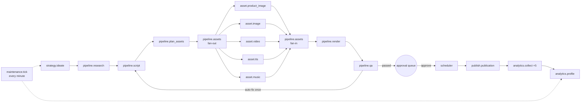

# Pipeline

From a product to a published, measured video. Every step is a job (`GenerationJob` row → queue → handler in
`packages/pipeline/src/steps/`), every handler is idempotent, and every paid call is budget-guarded.



| Job type               | Queue              | Timeout | Attempts | What it does                                                                          |
| ---------------------- | ------------------ | ------- | -------- | ------------------------------------------------------------------------------------- |
| `strategy.ideate`      | `strategy`         | 2 min   | 3        | Generates ideas, scores them, creates projects for the best ones                      |
| `pipeline.research`    | `research`         | 2 min   | 3        | Research brief from stored product facts only                                         |
| `pipeline.script`      | `scripts`          | 3 min   | 3        | Script, visual plan, hook variants, platform captions                                 |
| `pipeline.plan_assets` | `scripts`          | 1 min   | 3        | Tier routing (with reasons), asset plan                                               |
| `pipeline.assets`      | `scripts`          | 1 min   | 3        | Fan-out of missing assets; fan-in moves the project to rendering when all are READY   |
| `asset.product_image`  | `images`           | 2 min   | 3        | Real product image → background removal → product card                                |
| `asset.image`          | `images`           | 3 min   | 3        | Generated background / scene image                                                    |
| `asset.video`          | `video_generation` | 15 min  | 2        | Optional 5 s image-to-video shot (Tier ≥ 1 only)                                      |
| `asset.tts`            | `tts`              | 3 min   | 3        | Optional voice-over with word timings                                                 |
| `asset.music`          | `tts`              | 2 min   | 2        | Procedural (licence-free) music bed                                                   |
| `pipeline.render`      | `render`           | 15 min  | 2        | FFmpeg master render, cover, platform variants, optional A/B arm                      |
| `pipeline.qa`          | `qa`               | 3 min   | 3        | Media probes + text/compliance checks → score, blockers, auto-fix                     |
| `publish.publication`  | `publish`          | 10 min  | 4        | Publishes one variant to one account at its slot; polls async uploads                 |
| `analytics.collect`    | `analytics`        | 2 min   | 3        | One cumulative metrics snapshot (1 h, 6 h, 24 h, 72 h, 7 d after publishing)          |
| `analytics.profile`    | `analytics`        | 2 min   | 2        | Rebuilds the brand performance profile                                                |
| `maintenance.tick`     | `maintenance`      | 2 min   | 1        | Resume budget-blocked work, auto-ideation, archiving, stale reservations, experiments |

Timeouts and attempts live in `packages/config/src/defaults.ts` (`JOB_DEFAULTS`).

## 1. Ideation and opportunity scoring

`strategy.ideate` (manual "Generate ideas", or the maintenance tick when a brand has `autoIdeationEnabled`):

1. Loads the brand (voice, audience, rules, monetization models), its active products with **sourced facts**,
   recent titles/hooks to avoid, and the brand's performance profile text (the learning loop).
2. Asks the LLM for more ideas than needed (`count × 2 + 1`), strict JSON validated by Zod.
3. Scores each idea with `scoreOpportunity` (`packages/core/src/strategy/scoring.ts`, model `heuristic-v1`):
   expected impressions × expected CTR × expected conversion rate × value per conversion − estimated cost, plus
   purchase intent, hook strength, novelty (similarity to recent content; near-duplicates are halved), brand fit
   and commission. Baselines come from the brand's history or conservative priors.
4. Creates `ContentProject`s for the best ideas. **Scores are estimates** and are stored in `OpportunityScore`,
   never mixed with measured analytics.

## 2. Research and script

- `pipeline.research` builds a brief (positioning, benefits mapped to fact ids, pain points, objections) from
  stored facts only — the model is told not to invent features, prices, reviews or testimonials.
- `pipeline.script` produces the scene list (hook within the first ~3 s, body, CTA last), on-screen text,
  optional voice-over, a visual plan, alternative hooks and per-platform captions. Every claim must reference a
  stored fact id (`claimsUsed`). Prompts are versioned (`packages/ai/src/prompts/*`); each generation records the
  prompt version.

## 3. Tier routing and assets

`pipeline.plan_assets` asks the `MediaGenerationRouter` how much media money this item may use:

| Evidence (product / idea) | Base tier | Typical media                                                   |
| ------------------------- | --------- | --------------------------------------------------------------- |
| UNPROVEN                  | Tier 0    | Real product image cut-out, ≤ 2 cheap generated backgrounds     |
| PROMISING                 | Tier 1    | + one 5 s image-to-video shot from a low-cost model, voice-over |
| HIGH                      | Tier 2    | Better image/video models                                       |
| PROVEN_WINNER             | Tier 3    | Premium models, up to 3 AI shots                                |

It then downgrades for: requested quality, brand tier ceiling, brands that disallow AI video, non-video formats,
expected value (cost must stay below 35% of the idea's estimated revenue above Tier 0), remaining budget,
per-content cap and AI-video cap. If even Tier 0 does not fit, the project becomes `BUDGET_BLOCKED`. All reasons
are stored on the project and shown on `/content/[id]`.

`pipeline.assets` fans out one job per missing asset. Assets are **content-addressed**: the same inputs reuse an
existing READY asset instead of paying again. Async providers persist their request id before polling, so a
crashed worker resumes the same paid request.

## 4. Render

`pipeline.render` builds a JSON `VideoProject` (scenes, layers, timings, transitions, captions, audio) and the
FFmpeg compositor renders it to 1080×1920 H.264/AAC (`packages/media`):

- scene renderers for product cards, generated stills with motion (zoom/pan/parallax), AI clips;
- kinetic typography via libass (pop, slide, word highlight), safe margins clear of platform UI;
- subtitles from TTS word timings (exact with ElevenLabs, estimated otherwise);
- voice/music mix with ducking, logo, CTA card, progress bar, brand template;
- **scene cache** keyed by a hash of the scene spec + renderer/compositor versions: a text edit re-renders only
  the final pass;
- cover image and one `ContentVariant` per target platform (caption with disclosures, hashtags, tracked link).

Renders are reproducible: the same `VideoProject` and asset hashes produce the same output.

## 5. Automated QA

`pipeline.qa` scores the item 0–100 (blocker −40, major −12, minor −4) and fails on any blocker:

- **Media** (ffprobe/ffmpeg probes): video stream present, expected resolution, duration sanity (flagged below
  12 s or above 60 s; scripts target 15–45 s), black frames, segments without motion, loudness far from
  −14 LUFS, missing audio, placeholder product imagery.
- **Text & compliance** (`packages/core/src/qa/text-checks.ts`): placeholders, unbalanced markup, missing or late
  CTA, hook length, duplicate hook/caption vs. recent content, banned words, claims not backed by stored facts
  (superlatives, guarantees, medical/clinical, safety, income, scarcity, "free" offers), prices without a source
  or out of date, missing or non-prominent affiliate/ad/AI disclosure, missing link, hashtag limits, caption
  length.
- Optional LLM text review (`qa.text_review` prompt) for tone and subtle claim problems.

Below the brand's threshold (default 70) or with a blocker the item is **auto-rejected**. For fixable text
problems (hook, CTA, caption) the pipeline tries **one** automatic regeneration of that scope; if that fails too,
the item waits for the owner with the QA report.

## 6. Approval (owner)

`/approval` is a mobile-first queue. Per item the owner sees the video, cover, hook, caption per platform, tier,
QA report and cost so far, and can:

| Action               | Effect                                                                                         |
| -------------------- | ---------------------------------------------------------------------------------------------- |
| **Approve**          | All platform variants approved (or a selected subset; the rest are skipped) → scheduled        |
| **Reject** + reason  | Weak hook, bad image, bad video, incorrect product, bad voice, bad CTA, factual problem, other |
| **Regenerate** scope | Entire, script, hook, caption, image, video scene, voice — only that scope is redone           |
| **Edit text**        | Hook / CTA / captions edited in place; edited captions are locked against later re-renders     |

Regeneration is capped per item (`maxRegenerations`, default 3) and re-enters the pipeline at the right step
(hook/caption keep the tier and every asset; image/scene/voice regenerate only that asset). Every decision is
stored as an `Approval` row with the reason.

## 7. Scheduling and publishing

Approval schedules each approved variant into the brand's next free **publishing slot** for that platform (seeded
defaults: TikTok 12:00, Instagram 15:00, Facebook 18:00 in the brand's time zone; never sooner than 10 minutes).
`publish.publication` runs at slot time:

1. picks the publisher: mock accounts always use `MockSocialPublisher`; real accounts require
   `PUBLISHING_ENABLED=true` (otherwise the publication stays SCHEDULED with `PUBLISHING_DISABLED`);
2. loads and decrypts the account's OAuth token (refreshing TikTok tokens when they are about to expire);
3. validates the post against platform limits, creates short-lived signed media URLs (S3/R2) and publishes;
4. asynchronous uploads (IG containers, TikTok publish ids, FB reels) are polled every minute (max 30 polls);
5. a publication left in `PUBLISHING` by a crashed worker is **never** blindly re-posted — it fails with
   `UNKNOWN_OUTCOME` for the owner to check, so a post can't go out twice.

Auth failures flag the social account `NEEDS_REAUTH` and stop further attempts until it is reconnected.
Rate limits and 5xx are retried with backoff. Details: [SOCIAL_APIS.md](SOCIAL_APIS.md).

## 8. Analytics, clicks and revenue

- `analytics.collect` stores a **new** snapshot each time (1 h, 6 h, 24 h, 72 h, 7 d); reports use the latest
  snapshot per publication. After 14 days the content is `ARCHIVED` with its history kept.
- Clicks come from our own redirect `/go/<code>` (one tracked link per variant). Instagram and TikTok captions
  are not clickable, so links are listed on the brand's bio page `/b/<slug>`; Facebook captions carry the link.
- Conversions and revenue arrive via manual entry, CSV import or authenticated postbacks
  (`/api/webhooks/conversions/<programId>`), attributed through the click id we pass as the network sub-id
  (or the link code for programs that forbid redirects).
- Profit = revenue − AI generation cost − infrastructure − ad spend, by brand, content, product, platform and
  day (`/analytics`, `/costs`).

In mock mode the publisher simulates impressions and a funnel of clicks/conversions; all such rows are flagged
`isSimulated` and shown as simulated.

## 9. Learning loop

`analytics.profile` aggregates per-post results by hook style, angle, CTA type, duration bucket, template,
product, posting time, platform and tier, compares each against the brand baseline (RPM once there is revenue,
CTR before) and keeps patterns with enough samples. The compact text is injected into the next ideation and
script prompts ("prefer … avoid …"); product evidence levels feed the tier router. No ML — transparent rules.

## A/B experiments

With `experimentsEnabled` on a brand, a project can test one cheap variable without new assets:

- **HOOK** (brands without voice-over): arm B is a final-pass re-render with the alternative on-screen hook;
  all scenes come from the cache.
- **CAPTION** (brands with voice-over): arm B keeps the same video and opens the caption with the alternative
  hook, so narration never contradicts the screen.

Both arms go to the brand's primary platform (TikTok when targeted) in separate slots with separate tracked
links. The maintenance tick concludes an experiment once every arm has 72 h of data: CTR (tracked clicks /
impressions) with at least 300 impressions per arm and ≥ 10% relative lift, otherwise **inconclusive** — a wrong
winner fed into the learning loop is worse than none (`ctr-compare-v1`).

## Budget blocking and recovery

A paid step that would exceed any budget throws `BudgetBlockedError` **before** calling the provider. The job and
the project become `BUDGET_BLOCKED` with the exact limit, current spend and requested amount. The maintenance tick
re-queues blocked jobs once a new budget period starts or the limit is raised; the project resumes where it
stopped.

## Failures and retries

| Error                                                        | Classification | Result                                                           |
| ------------------------------------------------------------ | -------------- | ---------------------------------------------------------------- |
| Timeout, network, 408/409/425/429/5xx, Meta throttling codes | retryable      | `RETRYING` with exponential backoff, then `DEAD_LETTER`          |
| 4xx, validation, invalid post, auth/permission errors        | fatal          | `FAILED` (no retry); auth errors flag the account `NEEDS_REAUTH` |
| Budget exceeded                                              | budget_blocked | `BUDGET_BLOCKED`, resumed automatically when budget allows       |

`/jobs` lists failed, dead-lettered and blocked jobs with their event timeline; any of them can be retried.

## Running it

```bash
pnpm demo                                   # one Demo Tools video, full 1080×1920, 8 simulated days
pnpm demo --brand all --count 2 --fast      # every demo brand, 540×960 preview renders
pnpm worker                                 # real worker (BullMQ + Redis), all queues
WORKER_QUEUES=render,qa pnpm worker         # dedicated render/QA worker
```

The demo forces `MOCK_AI`, `MOCK_MEDIA`, `MOCK_SOCIAL` and `PUBLISHING_ENABLED=false` regardless of `.env`.
