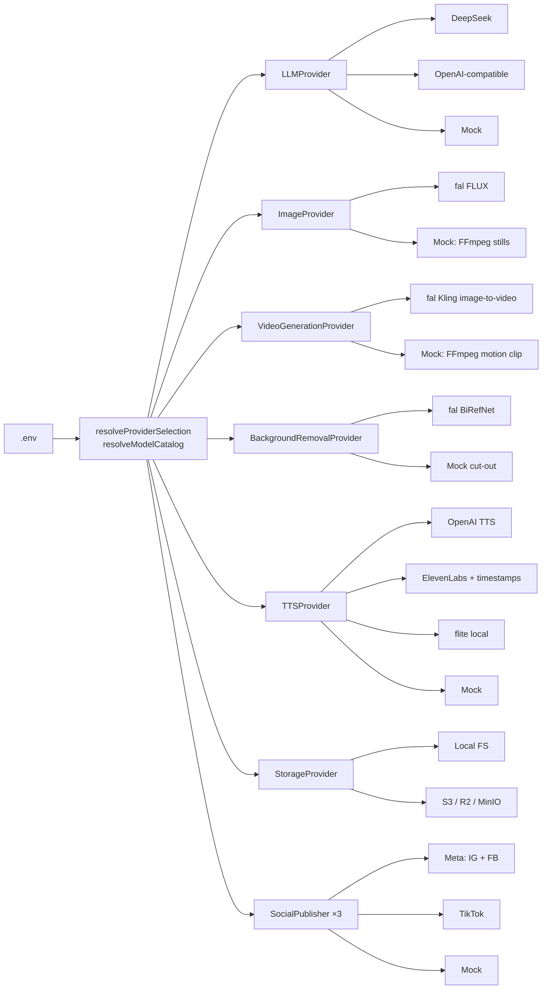

# Providers

Every external capability sits behind an interface. Business code never names a vendor; configuration in
`packages/config/src/providers.ts` picks the implementation and model, and the registries
(`packages/ai/src/registry.ts`, `packages/providers/src/registry.ts`, `packages/publishing/src/registry.ts`)
construct them.

All providers expose:

| Method           | Contract                                                                                                 |
| ---------------- | -------------------------------------------------------------------------------------------------------- |
| `healthCheck()`  | Never spends money (key present, free endpoints only — e.g. DeepSeek `/user/balance`).                   |
| `estimateCost()` | Pre-call estimate from the pricing catalog; used by the BudgetGuard **before** executing.                |
| `execute()`      | The call itself; receives an `AbortSignal`, a scratch directory and (async APIs) a request id to resume. |

`/settings/providers` shows the active selection, models and health (admins can run the checks).

## Mock mode

| Flag               | Default    | Effect                                                                                                   |
| ------------------ | ---------- | -------------------------------------------------------------------------------------------------------- |
| `MOCK_AI=true`     | on         | `MockLLMProvider`: deterministic, schema-valid structured output; can inject malformed output for tests. |
| `MOCK_MEDIA=true`  | on         | Images, clips, cut-outs, speech and music generated locally with FFmpeg — real files, zero spend.        |
| `MOCK_SOCIAL=true` | on         | `MockSocialPublisher`: simulated publishing and analytics; data flagged `isSimulated`.                   |
| `MOCK_COST_MODE`   | `simulate` | `simulate` records what the real provider _would_ have charged (flagged `isMock`); `zero` records $0.    |

In mock mode the brand and workspace budgets are enforced against the **simulated** costs, so budget blocking
and tier downgrades can be exercised for free. The system-wide fail-safe `HARD_DAILY_BUDGET_USD` counts real
spend only, and reports keep simulated and real money apart (simulated values are labelled as such).

## LLM

| Setting                           | Notes                                                                                                                     |
| --------------------------------- | ------------------------------------------------------------------------------------------------------------------------- |
| `LLM_PROVIDER=deepseek` (default) | `DEEPSEEK_API_KEY`, `DEEPSEEK_BASE_URL` (default `https://api.deepseek.com`), `DEEPSEEK_MODEL` (default `deepseek-chat`). |
| `LLM_PROVIDER=openai`             | Any OpenAI-compatible Chat Completions API: OpenAI, OpenRouter, vLLM, Ollama … via `OPENAI_BASE_URL`, `OPENAI_MODEL`.     |

- **JSON mode + Zod.** Structured prompts request `response_format: json_object` and validate with Zod; invalid
  output is sent back with the validation errors (bounded repair loop, larger token budget after truncation).
- **Prompt caching.** DeepSeek reports `prompt_cache_hit_tokens`; cache hits are priced at the discounted rate.
  Stable prompt prefixes (system prompt, schema) maximise hits.
- **Errors.** 429/5xx/network → retryable; 402 (insufficient balance), 401/403, 4xx → fatal; an unparseable body is
  retryable and counted as charged.
- Prompts are versioned modules in `packages/ai/src/prompts/` (strategy, research, script, hooks, captions, QA,
  scoring). Changing a template requires a version bump (a snapshot test enforces it); each generation stores
  the prompt version used.
- Claude Code is a development tool for this repository, **not** the runtime model.

## Images, background removal, image-to-video (fal.ai)

One `FAL_KEY` enables all three. Model per class (override with `IMAGE_MODEL_*` / `VIDEO_MODEL_*`):

| Capability         | cheap                                             | standard                                     | premium                                         |
| ------------------ | ------------------------------------------------- | -------------------------------------------- | ----------------------------------------------- |
| Image (FLUX)       | `fal-ai/flux/schnell`                             | `fal-ai/flux/dev`                            | `fal-ai/flux-pro/v1.1`                          |
| Image-to-video     | `fal-ai/kling-video/v2.1/standard/image-to-video` | `fal-ai/kling-video/v2.1/pro/image-to-video` | `fal-ai/kling-video/v2.1/master/image-to-video` |
| Background removal | `fal-ai/birefnet`                                 |                                              |                                                 |

How the adapter protects money (`packages/providers/src/fal/client.ts`):

1. Submits to the **queue API** and immediately persists the returned request URL on the asset
   (`onExternalJobId`) — before polling.
2. A retried or restarted job passes that URL back and **resumes polling** instead of submitting (and paying)
   again.
3. A failed generation is reported as non-retryable and _charged_ (the reservation is committed, not released);
   safety-checker hits are rejected without download.
4. Downloads are size-limited, streamed to a temp file and renamed only when complete.

Product imagery policy: real product photos are cut out and composited; generated images are used for scenes and
backgrounds, never to fake packaging, logos or product results.

## Text-to-speech

| `TTS_PROVIDER`     | Word timings                  | Notes                                                            |
| ------------------ | ----------------------------- | ---------------------------------------------------------------- |
| `openai` (default) | estimated from audio duration | `OPENAI_API_KEY`, model `tts-1`                                  |
| `elevenlabs`       | exact (character timestamps)  | `ELEVENLABS_API_KEY`, `ELEVENLABS_VOICE_ID`, `eleven_flash_v2_5` |
| `flite`            | estimated                     | Local and free, robotic voice — useful for testing timings       |
| `mock`             | estimated                     | Local FFmpeg speech/silence                                      |

Voice-over is per brand (`ttsEnabled`). AI voices are labelled in the asset licence (disclose where required).

## Music

`ProceduralMusicProvider` generates licence-free beds locally (no third-party audio, no copyright risk). Asset
provenance stores the licence of every asset.

## Storage

| `STORAGE_DRIVER`  | Use                                                                                                                                                                     |
| ----------------- | ----------------------------------------------------------------------------------------------------------------------------------------------------------------------- |
| `local` (default) | Development. Files under `STORAGE_LOCAL_DIR`; the web app streams them to signed-in users.                                                                              |
| `s3`              | Production. Cloudflare R2 (recommended — no egress fees), AWS S3 or MinIO. Needed for real publishing because platforms pull media from short-lived **presigned URLs**. |

R2: `S3_ENDPOINT=https://<account>.r2.cloudflarestorage.com`, `S3_REGION=auto`, `S3_BUCKET`, access keys.
MinIO for local testing: `docker compose --profile s3 up -d`, `S3_FORCE_PATH_STYLE=true`. Keys are validated
against path traversal; FFmpeg reads remote objects through a local cache.

## Social publishers

`MockSocialPublisher`, `MetaPublisher` (Instagram Reels, Facebook Page Reels) and `TikTokPublisher` (Content
Posting API, direct post). Interface: `validate`, `publish`, `schedule` (Facebook only), `getStatus`,
`getAnalytics`, `healthCheck`. Setup and API details: [SOCIAL_APIS.md](SOCIAL_APIS.md).

## What is verified, and what is not

| Adapter                        | Verified here                                                                                       | Not verified                            |
| ------------------------------ | --------------------------------------------------------------------------------------------------- | --------------------------------------- |
| Mock LLM / media / social      | End to end against PostgreSQL + FFmpeg (integration tests, `pnpm demo`)                             | —                                       |
| DeepSeek / OpenAI-compatible   | Request shape, JSON mode, usage & cache-hit parsing, error mapping, repair loop (stubbed HTTP)      | Live API calls (no key was used)        |
| fal.ai image / video / cut-out | Queue submit → persist → poll → result, resume without resubmit, failures, downloads (stubbed HTTP) | Live API calls, current response shapes |
| OpenAI / ElevenLabs TTS        | Request shape, file output, timestamp → word timings (stubbed HTTP)                                 | Live API calls                          |
| S3 / R2                        | Presigned URL generation (offline), key validation                                                  | Uploads against a real bucket           |
| Meta / TikTok                  | Full publish/status/analytics/OAuth flows and error classification (stubbed HTTP)                   | Live APIs, app review, real accounts    |

Before enabling a real provider: set a small budget, run one item, compare the recorded `estimatedCostUsd` with
the provider's dashboard/invoice, and adjust the pricing catalog if needed (see [COST_MODEL.md](COST_MODEL.md)).

## Adding a provider

1. Implement the interface (`packages/providers/src/types.ts`, `packages/ai/src/types.ts` or
   `packages/publishing/src/types.ts`) including `healthCheck` and `estimateCost`.
2. Add its name to the env enum and the selection in `packages/config/src/providers.ts`; construct it in the
   registry.
3. Add prices to `packages/config/src/pricing.ts` (with an "as of" date). Unknown models fall back to a
   deliberately pessimistic price.
4. Add stubbed-HTTP tests like `packages/providers/src/providers.test.ts`.
