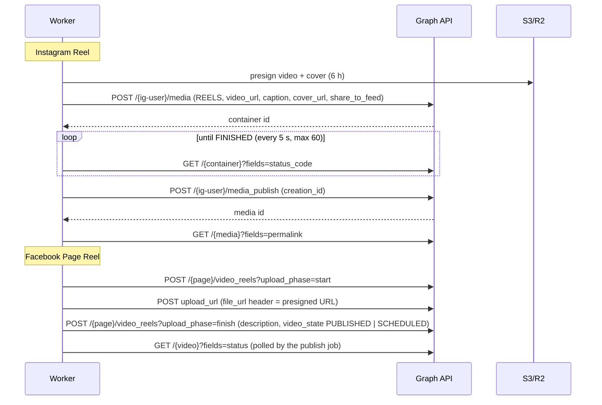
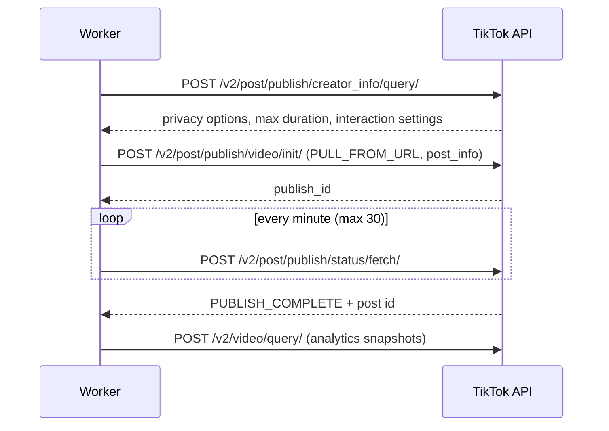

# Social platform APIs

Publishing uses **official APIs only** — no browser automation, no unofficial endpoints, no scraping. By default
nothing is posted anywhere:

- `MOCK_SOCIAL=true` (default) routes every account to `MockSocialPublisher`;
- accounts created by the seed are mock accounts;
- `PUBLISHING_ENABLED=false` (default) refuses every real publication even for connected accounts and approved
  content;
- TikTok posts are private (`TIKTOK_PRIVACY_LEVEL=SELF_ONLY`) unless configured otherwise.

> **Verification status.** The Meta and TikTok adapters are implemented against the documented APIs and tested
> with scripted HTTP responses (`packages/publishing/src/publishers.test.ts`). They have **not** been exercised
> against the live APIs from this repository. Platform APIs, metric names and review requirements change often —
> check the current documentation and test with a private/test account before enabling publishing.

## Going live — checklist

1. Storage on S3/R2 (`STORAGE_DRIVER=s3`): platforms pull videos from short-lived presigned URLs (6 h).
2. `APP_URL` is the public HTTPS URL of the web app (tracking links, bio pages, OAuth redirects). Publishing a
   post whose link points to localhost is refused (`APP_URL_NOT_PUBLIC`).
3. `CREDENTIALS_ENCRYPTION_KEY` set (tokens are stored AES-256-GCM encrypted).
4. Create the platform apps below, set their env vars, register the redirect URIs.
5. Connect each brand's accounts on `/brands/[id]` (owner/admin only). Real accounts replace the mock ones for
   scheduling.
6. `MOCK_SOCIAL=false`, and only when you intend to post: `PUBLISHING_ENABLED=true`.
7. Approve one item, watch `/jobs` and the publication status; check the post on the platform.

## Meta — Instagram Reels and Facebook Page Reels

**Requirements**

- A Meta developer app (business type) with Facebook Login for Business, Instagram Graph API and Pages API.
- An Instagram **professional** account (Business or Creator) linked to a Facebook Page; the connecting user must
  manage the Page.
- Permissions requested: `instagram_basic`, `instagram_content_publish`, `instagram_manage_insights`,
  `pages_show_list`, `pages_read_engagement`, `pages_manage_posts`, `business_management`.
  In development mode they work for people with a role on the app; for other accounts Meta requires **App Review**
  (and usually Business Verification).
- Env: `META_APP_ID`, `META_APP_SECRET`, `META_GRAPH_API_VERSION` (default `v23.0`).
- Valid OAuth redirect URI: `${APP_URL}/api/oauth/meta/callback`.

**Connecting** (`/api/oauth/meta/start?brandId=…`): authorization code → short-lived user token → long-lived user
token (~60 days) → Pages with their linked Instagram accounts. One Page per brand (the one with a linked Instagram
account is preferred); the Facebook Page and the Instagram account become the brand's real social accounts. The
user and Page tokens are stored encrypted; the browser never sees them. The OAuth `state` is HMAC-signed and bound
to the user, brand and provider (10-minute cookie).

- **Captions**: links in Instagram captions are not clickable — the tracked link lives on the brand's bio page
  (`/b/<slug>`); Facebook captions carry the link directly.
- **Scheduling**: our scheduler publishes at the slot time; Facebook Pages also support native scheduling
  (`schedule()`, 10 minutes – 30 days ahead).
- **Limits**: Reels 3 s – 15 min on Instagram and 3 – 90 s on Facebook (as configured in
  `packages/publishing/src/limits.ts`); Instagram enforces a rolling 24-hour cap on API-published posts per
  account (see the `content_publishing_limit` endpoint).
- **Insights**: Instagram media insights (`views`, `reach`, `likes`, `comments`, `shares`, `saved`,
  `ig_reels_avg_watch_time`); Facebook `video_insights` (plays, unique impressions, average watch time,
  followers). Metric names change between Graph versions — verify against the version you pin.
- **Disclosure**: affiliate/ad disclosures are written into the caption (and on screen) by the brand's
  disclosure rules. Meta's "Paid partnership" label needs a brand-partner relationship and is not set by the
  adapter.
- **Tokens**: long-lived user tokens expire after ~60 days; expired tokens are refused before calling the API
  (`TOKEN_EXPIRED`), and an auth error from the API marks the account `NEEDS_REAUTH`. Reconnect on
  `/brands/[id]`.
- **Errors**: throttling (codes 4, 17, 32, 341, 613 — returned with HTTP 400) is retried with backoff; token
  errors (190, 102) and permission errors (10, 200–299) are not retried.

## TikTok — Content Posting API (Direct Post)

**Requirements**

- A TikTok for Developers app with **Login Kit** and the **Content Posting API** (Direct Post).
- Scopes: `user.info.basic`, `video.publish`, `video.upload`, `video.list` (analytics).
- Redirect URI: `${APP_URL}/api/oauth/tiktok/callback`.
- **Verified media domain**: `PULL_FROM_URL` only accepts URLs on a domain/URL prefix verified in the developer
  portal — serve the R2/S3 bucket through a custom domain you can verify.
- **Audit**: until TikTok audits the app, posts can only be private (`SELF_ONLY`) and only a limited number of
  accounts can authorise it. Public posting (`TIKTOK_PRIVACY_LEVEL=PUBLIC_TO_EVERYONE`) needs the audit, and
  TikTok's content-sharing guidelines expect the posting UI to show the creator's account, the privacy choice,
  interaction settings, commercial-content disclosure and consent before each post. The approval screen covers
  the human approval of every post; the TikTok-specific UI elements would need to be added for the audit.
- Env: `TIKTOK_CLIENT_KEY`, `TIKTOK_CLIENT_SECRET`, `TIKTOK_PRIVACY_LEVEL`.

**Connecting** (`/api/oauth/tiktok/start?brandId=…`): authorization code → access token (24 h) + refresh token
(365 days), stored encrypted. Access tokens are refreshed automatically when they expire within 10 minutes.

`post_info` set by the adapter:

| Field                             | Value                                                                          |
| --------------------------------- | ------------------------------------------------------------------------------ |
| `privacy_level`                   | `TIKTOK_PRIVACY_LEVEL` if the creator allows it, otherwise `SELF_ONLY`         |
| `is_aigc`                         | `true` when the content is AI-generated (AI-generated content label)           |
| `brand_content_toggle`            | `true` for affiliate/third-party promotions on visible posts (branded content) |
| `brand_organic_toggle`            | `true` when promoting the brand's own product on visible posts                 |
| `disable_comment / duet / stitch` | taken from the creator's own settings                                          |

TikTok does not allow branded content to be private, so the commercial toggles are only set when the post is
visible to others; caption disclosures still apply. Videos longer than the creator's limit are rejected before
upload. TikTok returns post ids as 64-bit integers; the adapter parses them exactly.

**Analytics**: `video/query` (`view_count`, `like_count`, `comment_count`, `share_count`). Clicks are measured by
our own tracked links, not by the platform.

## Links, bio pages and attribution

| Platform  | Where the link goes                                |
| --------- | -------------------------------------------------- |
| Facebook  | In the caption (clickable)                         |
| Instagram | Brand bio page `/b/<slug>` (put it in the profile) |
| TikTok    | Brand bio page `/b/<slug>`                         |

Each variant has its own tracked link (`/go/<code>`), so clicks are attributed to brand, content, platform and
product. Programs that forbid redirects get the raw affiliate URL with our link code as the sub-id.

## Mock publisher

`MockSocialPublisher` behaves like the real ones (asynchronous processing, status polling, metrics over time) and
generates deterministic, plausible metrics shaped by QA score, hook style and duration, plus simulated clicks and
conversions. Everything it creates is flagged `isMock` / `isSimulated`.
